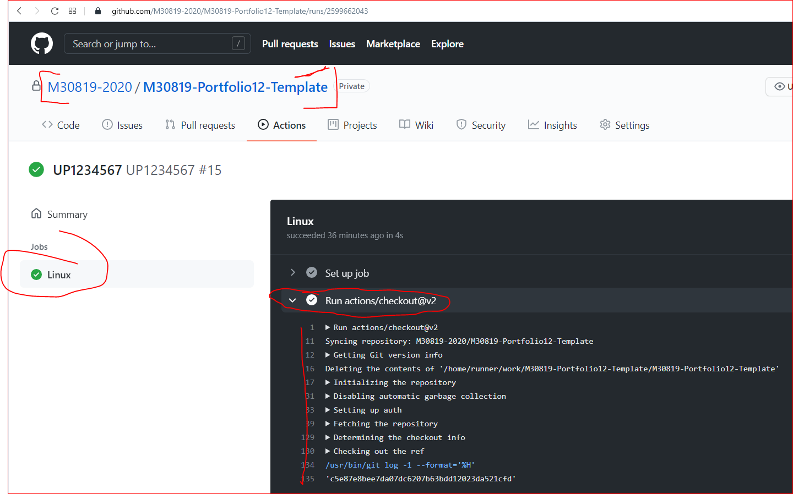
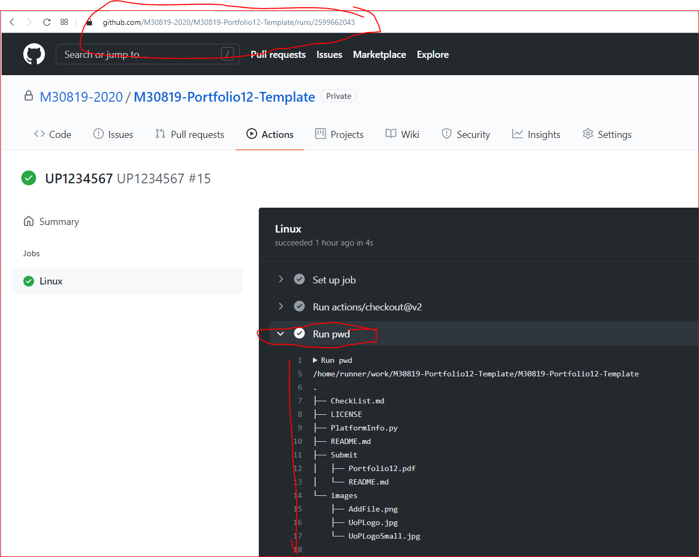
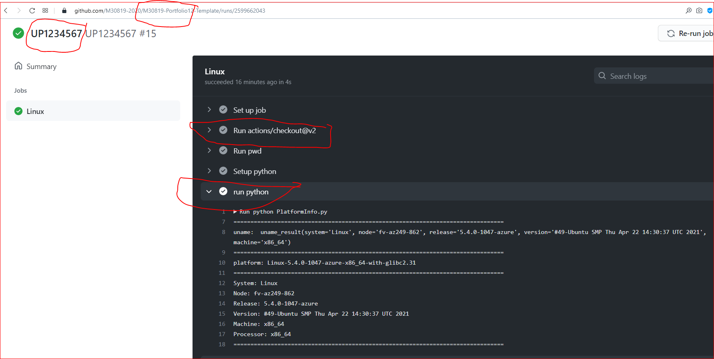
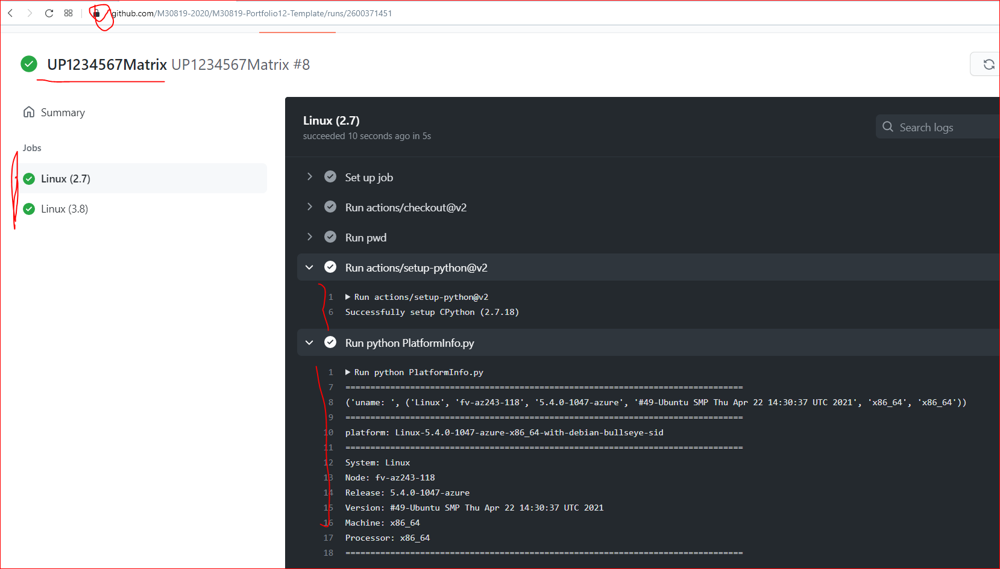
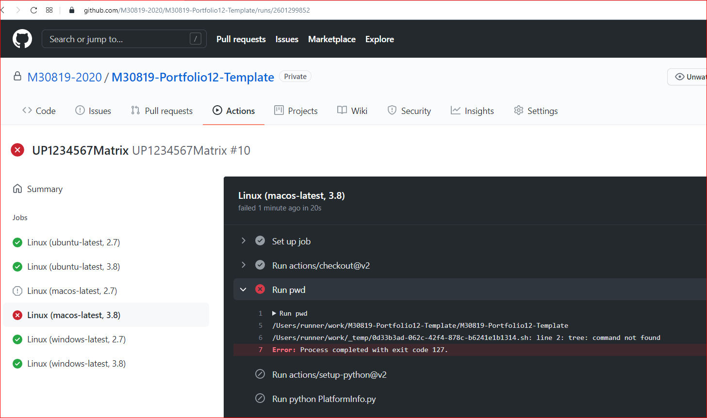

# **Software Engineering Theory and Practice**

|  School of Computing |  |
| --------------- | --------------- |
| Title | Software Engineering Theory and Practice |
| Module Coordinator| Steven Ossont|
| Email | steven.ossont@port.ac.uk|
| Code | M30819|
| Moodle | [https://moodle.port.ac.uk/course/view.php?id=11429](https://moodle.port.ac.uk/course/view.php?id=11429) |

## Schedule and Deliverables

| Item | Value | Format | Outcomes | Deadline |
| --- | --- | --- | --- | --- |
| Portfolio12 (Optional) | 1% | GitHub Repo | Pass/Fail |  28 May 2021, 23:00 |

## Notes and Advice

<!-- markdown-link-check-disable -->
* The [Extenuating Circumstances procedure](https://myport.port.ac.uk/my-course/extenuating-circumstances ) is
  there to support you if you have had any circumstances (problems) that have
  been serious or significant enough to prevent you from attending, completing
  or submitting an assessment on time.
* The UNION Extenuating Circumstances [Extenuating Circumstances procedure](https://upsu.net/advice/academic-advice/extenuating-circumstances)
* [ASDAC](https://myport.port.ac.uk/guidance-and-support/additional-support-and-disability-advice )
  are available to any students who disclose a disability or require additional
  support for their academic studies with a good set of resources on the [ASDAC
  Moodle site](https://moodle.port.ac.uk/course/view.php?id=3012)
* The University takes plagiarism seriously. Please ensure you adhere to the
  plagiarism guidelines.
Examination Regulations ([http://regulations.docstore.port.ac.uk/ExamRegs12AssessmentOffences.pdf](http://regulations.docstore.port.ac.uk/ExamRegs12AssessmentOffences.pdf)).
* Any material included in your coursework should be
  fully cited and referenced in APA format (seventh edition). Detailed advice on
  referencing is available from [http://referencing.port.ac.uk/](http://referencing.port.ac.uk/)
* Any material submitted that does not meet format or submission guidelines, or
  falls outside of the submission deadline could be subject to a cap on your
  overall result or disqualification entirely.
* If you need additional assistance, you can ask your personal tutor, learning
  support ana.baker@port.ac.uk and xia.han@port.ac.uk or your lecturers.
<!-- markdown-link-check-enable-->

## Git commands

> Your repository will be copied for marking automatically at the deadline.
> EDITS after the deadline are automatically ignored.

When you update the `CheckList.md` file. This will trigger an action to inspect the work for this part of the Portfolio.(You can also manually run the `PortfolioAdvisor` if you need to see if changes solve any errors)

Files, external to this repo and any images imported via URL will be ignored (Even if they are stored in GitHub).

Large blocks of text that use the 'CODE' formatting will be ignored. This includes using triple \`\`\` (Unless it is code or something sensible).
If it looks like you are using \`\`\` to contain Markdown to avoid the lint checker, it will be ignored.
Code blocks should be labeled with the code language so that the syntax highlighter is enabled.

Here is a helpful Markdown link: [https://github.com/adam-p/markdown-here/wiki/Markdown-Cheatsheet#code](https://github.com/adam-p/markdown-here/wiki/Markdown-Cheatsheet#code)

At no point in this Assessment should you use the `Add file` button on the GitHub webpage -- Pretend it does not exist

Marking is performed on a Ubuntu machine. This means that everything is case sensitive, where it may not be on Windows.

> Clone, Edit, Commit, Push  (Preferably on the command line)


## Objectives

* Creat a basic GitHub action

## Portfolio 12 Part 1

1. Create a file with the filename `Student.id`, add your Student ID to the content of this file. Note:

    * Invalid ID = No marks
    * The file extension is `.id` other file extensions e.g. `.txt` are not permitted
    * The content of the file should be your ID ONLY, e.g. `UP1234567`
    * You may have a return character at the end of the line `\n` (Note this is not two ASCII text characters)
    * You need the `UP`
    * Filename is case sensitive
    * File contents are case sensitive
    * File should contain one line of text only
    * Markdown formatting is NOT permitted e.g. `*` or `-`

2. Remove the `README.md` import statement from your `.pandoc.yml` file. This is here to generate a PDF of instructions, but should be removed and not included as part of your submission.

3. Import your `Student.id` as the **last** import in your `.pandoc.yml`. This will add your Student ID to your PDF submission.

   * Usually just after `CheckList.md`
<!-- Save, Commit -->

When you have completed this part of the portfolio :

* Add any files that are needed for this part (if any), to your GitHub repo E.g. new files that you created
* Put an `X` in the `CheckList.md` to indicate this part of the Portfolio is complete
* Commit and **push** your changes to GitHub
* Manually run the `PortfolioAdvisor` action, and ensure it passes. (Must PASS)
* Navigate to the `PortfolioAdvisor` action on GitHub.com and read the feedback / errors / comments
* Manually run the `Pandoc` action, and check the resulting PDF is as expected. (Must PASS)
* Manually run the `MarkdownChecker` action, this will be superseded by the super-linter. (Must PASS)
<!-- * Manually run the `SuperLinter` action, please do your best to ensure there are no errors on *your* files. (Feedback on this action is appreciated) -->
* Check you have an `X` in the `CheckList.md` to indicate this part of the Portfolio is complete
* Commit and **push** any subsequent changes you have made, to GitHub
* Be sure to address any errors from the GitHub actions
* You do not need to wait for the `PortfolioAdvisor` to complete, if it is running slow. Proceed and come back and look at the checker errors/warnings when it completes.

<!-- Save, Commit -->

## Portfolio 12 Part 2

1. Create a new file called `Portfolio.md` on the root of this repo.

2. Create a level 1 heading in `Portfolio.md` for this portfolio; Exactly like this (where `X` is the current portfolio number):

    ```markdown
    # Portfolio X
    ```

3. For every part of this Portfolio that adds content to this `.md` file, add a level **two** heading. Exactly like this:

    ```markdown
    ## Portfolio X Part Y
    ```

    (Where `X` is the Portfolio number and `Y` is the part number.)

4. Add the markdown `Portfolio.md` file to your `.pandoc` file so that it will be included into the resulting PDF. Check that your `Portfolio.md` content appears in the PDF once the pandoc action has completed (You may need to manually trigger the GitHub action)

<!-- TODO: SUMMARY -->
<!-- Save, Commit -->

When you have completed this part of the portfolio :

* Add any files that are needed for this part (if any), to your GitHub repo E.g. new files that you created
* Put an `X` in the `CheckList.md` to indicate this part of the Portfolio is complete
* Commit and **push** your changes to GitHub
* Manually run the `PortfolioAdvisor` action, and ensure it passes. (Must PASS)
* Navigate to the `PortfolioAdvisor` action on GitHub.com and read the feedback / errors / comments
* Manually run the `Pandoc` action, and check the resulting PDF is as expected. (Must PASS)
* Manually run the `MarkdownChecker` action, this will be superseded by the super-linter. (Must PASS)
<!-- * Manually run the `SuperLinter` action, please do your best to ensure there are no errors on *your* files. (Feedback on this action is appreciated) -->
* Check you have an `X` in the `CheckList.md` to indicate this part of the Portfolio is complete
* Commit and **push** any subsequent changes you have made, to GitHub
* Be sure to address any errors from the GitHub actions
* You do not need to wait for the `PortfolioAdvisor` to complete, if it is running slow. Proceed and come back and look at the checker errors/warnings when it completes.

<!-- Save, Commit -->

When you have completed this part of the portfolio :

* Add any files that are needed for this part (if any), to your GitHub repo E.g. new files that you created
* Put an `X` in the `CheckList.md` to indicate this part of the Portfolio is complete
* Commit and **push** your changes to GitHub
* Manually run the `PortfolioAdvisor` action, and ensure it passes. (Must PASS)
* Navigate to the `PortfolioAdvisor` action on GitHub.com and read the feedback / errors / comments
* Manually run the `Pandoc` action, and check the resulting PDF is as expected. (Must PASS)
* Manually run the `MarkdownChecker` action, this will be superseded by the super-linter. (Must PASS)
<!-- * Manually run the `SuperLinter` action, please do your best to ensure there are no errors on *your* files. (Feedback on this action is appreciated) -->
* Check you have an `X` in the `CheckList.md` to indicate this part of the Portfolio is complete
* Commit and **push** any subsequent changes you have made, to GitHub
* Be sure to address any errors from the GitHub actions
* You do not need to wait for the `PortfolioAdvisor` to complete, if it is running slow. Proceed and come back and look at the checker errors/warnings when it completes.

<!-- Save, Commit -->

## Portfolio 12 Part 3

In this portfolio you will create two GitHub actions and use them to execute an existing script. Read this article:

* [https://docs.github.com/en/actions/learn-github-actions/introduction-to-github-actions](https://docs.github.com/en/actions/learn-github-actions/introduction-to-github-actions)

There is plenty more information on actions, please be aware of the contents of this page:

* [https://docs.github.com/en/actions/learn-github-actions](https://docs.github.com/en/actions/learn-github-actions)

In this repo there is a python script `PlatformInfo.py`. You **cannot** alter the contents of this file.

There are two empty GitHub workflow files that you will edit for this Portfolio.

* `.github/workflows/StudentWorkflow.yml`
* `.github/workflows/StudentWorkflowMatrix.yml`

Do not edit any other files in the `.github/workflows/` folder.

1. All GitHub actions need a name. Add a name on line 1 of `.github/workflows/StudentWorkflow.yml`. Set this name to your Student ID.

    For example:

    ```yaml
    name: UP1234567
    ```

2. Change the name on line 1 of `.github/workflows/StudentWorkflowMatrix.yml` to your Student ID with `Matrix` appended to the end.

    For example:

    ```yaml
    name: UP1234567Matrix
    ```

    > The `.github/workflows` folder may be hidden on some operating systems. On Windows you should setup your machine so you can see hidden files.

<!-- Save, Commit -->

When you have completed this part of the portfolio :

* Add any files that are needed for this part (if any), to your GitHub repo E.g. new files that you created
* Put an `X` in the `CheckList.md` to indicate this part of the Portfolio is complete
* Commit and **push** your changes to GitHub
* Manually run the `PortfolioAdvisor` action, and ensure it passes. (Must PASS)
* Navigate to the `PortfolioAdvisor` action on GitHub.com and read the feedback / errors / comments
* Manually run the `Pandoc` action, and check the resulting PDF is as expected. (Must PASS)
* Manually run the `MarkdownChecker` action, this will be superseded by the super-linter. (Must PASS)
<!-- * Manually run the `SuperLinter` action, please do your best to ensure there are no errors on *your* files. (Feedback on this action is appreciated) -->
* Check you have an `X` in the `CheckList.md` to indicate this part of the Portfolio is complete
* Commit and **push** any subsequent changes you have made, to GitHub
* Be sure to address any errors from the GitHub actions
* You do not need to wait for the `PortfolioAdvisor` to complete, if it is running slow. Proceed and come back and look at the checker errors/warnings when it completes.

<!-- Save, Commit -->

## Portfolio 12 Part 4

Workflow files are defined in `YAML` which is markup language. YAML is space delimited (e.g. just like Python -- indentation counts!).

For those familiar with JSON you may want to read this short article comparing the two:

* [https://gettaurus.org/docs/YAMLTutorial/](https://gettaurus.org/docs/YAMLTutorial/)

Formatting YAML can be painful and you might want to consider ways to validate the content before committing:

* [https://github.com/cschleiden/vscode-github-actions](https://github.com/cschleiden/vscode-github-actions)

The complete workflow syntax is located here. You will need to understand and reference this page frequently when making actions:

[https://docs.github.com/en/actions/reference/workflow-syntax-for-github-actions](https://docs.github.com/en/actions/reference/workflow-syntax-for-github-actions)

1. Modify the `.github/workflows/StudentWorkflow.yml` so that the workflow is triggered **manually**.

    * You should have one line in your workflow so far (a name which you just set to your ID)
    * Read the `on` YAML options here:
       * [https://docs.github.com/en/actions/reference/workflow-syntax-for-github-actions#on](https://docs.github.com/en/actions/reference/workflow-syntax-for-github-actions#on)
    * There is a new `on` option that enables the `Run Workflow` button that you have used in previous portfolios.
      * [https://github.blog/changelog/2020-07-06-github-actions-manual-triggers-with-workflow_dispatch](https://github.blog/changelog/2020-07-06-github-actions-manual-triggers-with-workflow_dispatch)

    You do not need to provide any options to `workflow_dispatch`. Do **not** trigger the workflow on any other events, as this will result in multiple executions.

    For example:

    ```yaml
    on:
      workflow_dispatch:
    ```

    > Now your workflow has a name an did it will execute when the `Run workflow` button is pressed.

2. Add a `jobs` section that contains a single job called `LinuxJob`.

   You will need to read:
    * [https://docs.github.com/en/actions/reference/workflow-syntax-for-github-actions#jobsjob_id](https://docs.github.com/en/actions/reference/workflow-syntax-for-github-actions#jobsjob_id)

    In this example `jobs` is made up of one `job`. The job is called Linux:

    ```yaml
    jobs:
      # This workflow contains a single job called "Linux"
      Linux:
    ```

    > Be sure to understand the `YAML` that we are using, and how it relates to the syntax definition. Only using copy & paste will quickly become an illegible mess that will take ages to debug.

<!-- Save, Commit -->

When you have completed this part of the portfolio :

* Add any files that are needed for this part (if any), to your GitHub repo E.g. new files that you created
* Put an `X` in the `CheckList.md` to indicate this part of the Portfolio is complete
* Commit and **push** your changes to GitHub
* Manually run the `PortfolioAdvisor` action, and ensure it passes. (Must PASS)
* Navigate to the `PortfolioAdvisor` action on GitHub.com and read the feedback / errors / comments
* Manually run the `Pandoc` action, and check the resulting PDF is as expected. (Must PASS)
* Manually run the `MarkdownChecker` action, this will be superseded by the super-linter. (Must PASS)
<!-- * Manually run the `SuperLinter` action, please do your best to ensure there are no errors on *your* files. (Feedback on this action is appreciated) -->
* Check you have an `X` in the `CheckList.md` to indicate this part of the Portfolio is complete
* Commit and **push** any subsequent changes you have made, to GitHub
* Be sure to address any errors from the GitHub actions
* You do not need to wait for the `PortfolioAdvisor` to complete, if it is running slow. Proceed and come back and look at the checker errors/warnings when it completes.

<!-- Save, Commit -->

## Portfolio 12 Part 5

We need to pick an operating system that will be used to execute our the python `PlatformInfo.py` script. The list of hosted GitHub OS versions are detailed here:

  * [https://docs.github.com/en/actions/using-github-hosted-runners/about-github-hosted-runners#supported-runners-and-hardware-resources](https://docs.github.com/en/actions/using-github-hosted-runners/about-github-hosted-runners#supported-runners-and-hardware-resources)

1. Set the operating system in your `StudentWorkflow.yml` file to Ubuntu by adding a `runs-on` parameter to your `LinuxJob`.

    * Read: [https://docs.github.com/en/actions/learn-github-actions/introduction-to-github-actions](https://docs.github.com/en/actions/learn-github-actions/introduction-to-github-actions)
    * You should **never** use any YAML OS workflow label that ends with `-latest`. If you do, a working workflow/action might break randomly in the future as the OS version advances. You will suspect the failure is due to a change in your code and spend ages debugging perfectly operational code.
    * Use Ubuntu version 18.
    * It is also good practice to add `[` and `]` around your selected OS, to indicate that this can be a list.

    > TIP: You can see which packages/tools are installed on any supported OS, e.g. [https://github.com/actions/virtual-environments/blob/main/images/linux/Ubuntu2004-README.md](https://github.com/actions/virtual-environments/blob/main/images/linux/Ubuntu2004-README.md)

    In this example, there is one job `Linux` and it runs on the latest version of `Ubuntu`:

    ```yaml
    jobs:
      # This workflow contains a single job called "linux"
      Linux:
        # The type of runner that the job will run on
        runs-on: [ubuntu-latest]
    ```
    <!-- Save, Commit -->

When you have completed this part of the portfolio :

* Add any files that are needed for this part (if any), to your GitHub repo E.g. new files that you created
* Put an `X` in the `CheckList.md` to indicate this part of the Portfolio is complete
* Commit and **push** your changes to GitHub
* Manually run the `PortfolioAdvisor` action, and ensure it passes. (Must PASS)
* Navigate to the `PortfolioAdvisor` action on GitHub.com and read the feedback / errors / comments
* Manually run the `Pandoc` action, and check the resulting PDF is as expected. (Must PASS)
* Manually run the `MarkdownChecker` action, this will be superseded by the super-linter. (Must PASS)
<!-- * Manually run the `SuperLinter` action, please do your best to ensure there are no errors on *your* files. (Feedback on this action is appreciated) -->
* Check you have an `X` in the `CheckList.md` to indicate this part of the Portfolio is complete
* Commit and **push** any subsequent changes you have made, to GitHub
* Be sure to address any errors from the GitHub actions
* You do not need to wait for the `PortfolioAdvisor` to complete, if it is running slow. Proceed and come back and look at the checker errors/warnings when it completes.

<!-- Save, Commit -->

## Portfolio 12 Part 6

The job needs some steps (tasks) to perform, these are called steps. Read:

* [https://docs.github.com/en/actions/reference/workflow-syntax-for-github-actions#jobsjob_idsteps](https://docs.github.com/en/actions/reference/workflow-syntax-for-github-actions#jobsjob_idsteps)

1. Give your first step the name `Checkout my repo` and call `actions/checkout@v2` to clone your repo.

    * Read the checkout options: [https://github.com/actions/checkout](https://github.com/actions/checkout)
    * Checkout this repo as your first step (we will need our code so we can do something). There is a very simple predefined action to do this: `actions/checkout@v2`
    * Note we will specify a version for this action:  `@v2`. You should **always** specify a version when calling an action.

    In this example there is only one step to the steps section, it has a name `Checkout` and it will checkout the current repo using the `actions/checkout@v2` action.

    ```yaml
        steps:
        - name: Checkout
          uses: actions/checkout@v2
    ```

    > We are building up the `.yml` file as we go, be careful to get the formatting / layout correct.

2. You can **now run** this workflow. It will start up a Ubuntu instance and checkout your repo (this repo)

    > Your action **must** run successfully. Do not proceed until it runs without failure.

3. Capture a `WorkflowRunning.png` that shows the successful run of your workflow. Add this image to your `Portfolio.md` file. Your image must include:

    * Your full repo url and name
    * The job name
    * The expanded call to checkout v2

    For example:

    

<!-- Save, Commit -->

When you have completed this part of the portfolio :

* Add any files that are needed for this part (if any), to your GitHub repo E.g. new files that you created
* Put an `X` in the `CheckList.md` to indicate this part of the Portfolio is complete
* Commit and **push** your changes to GitHub
* Manually run the `PortfolioAdvisor` action, and ensure it passes. (Must PASS)
* Navigate to the `PortfolioAdvisor` action on GitHub.com and read the feedback / errors / comments
* Manually run the `Pandoc` action, and check the resulting PDF is as expected. (Must PASS)
* Manually run the `MarkdownChecker` action, this will be superseded by the super-linter. (Must PASS)
<!-- * Manually run the `SuperLinter` action, please do your best to ensure there are no errors on *your* files. (Feedback on this action is appreciated) -->
* Check you have an `X` in the `CheckList.md` to indicate this part of the Portfolio is complete
* Commit and **push** any subsequent changes you have made, to GitHub
* Be sure to address any errors from the GitHub actions
* You do not need to wait for the `PortfolioAdvisor` to complete, if it is running slow. Proceed and come back and look at the checker errors/warnings when it completes.

<!-- Save, Commit -->

## Portfolio 12 Part 7

View the files that we have checked out by adding another step to your workflow.

* Read [https://docs.github.com/en/actions/reference/workflow-syntax-for-github-actions#jobsjob_idstepsrun](https://docs.github.com/en/actions/reference/workflow-syntax-for-github-actions#jobsjob_idstepsrun)
* As you will very often want to execute multiple commands e.g. `cd` then `cat` it is best to always use the pipe `|` character. Be sure you know what this character does and where to put it.

1. Add **another** step to your workflow that runs two shell commands `pwd` and `tree`. Name this step `List files`

    In the example below, we print the current directory `pwd` and list the files using `tree` in a step called `pwd`.

    ```yaml
        steps:
          <...>
          - name: pwd
            run: |
              pwd
              tree .

    ```

3. Run your workflow and add a `ListFiles.png` image of the output to your `Portfolio.md` file.

    For example:

    

4. Install Version 3 of python and execute the `PlatformInfo.py` script that is supplied in this repo.

    * Read: [https://github.com/actions/setup-python](https://github.com/actions/setup-python)
    * Name this step `name : Run Python`
    * Version `3.x` will work

    In the example below we install Python 3.x and run the script `my_script.py`:

    ```yaml
    steps:
    <...>
    - uses: actions/setup-python@v2
      with:
        python-version: '3.x' # Version range or exact version of a Python version to use, using SemVer's version range syntax
        architecture: 'x64' # optional x64 or x86. Defaults to x64 if not specified
    - run: python my_script.py
    ```

    >Tip: The above example does not give the steps any names, you need not name your steps.

5. Run your workflow. Create a `Script.png` image of your output and add it to the `Portfolio.md` file.

    * It must show your repo URL
    * It must show your checkout and list files steps.
    * It must show an expanded output from the python execution.

    For example:

    

<!-- Save, Commit -->

When you have completed this part of the portfolio :

* Add any files that are needed for this part (if any), to your GitHub repo E.g. new files that you created
* Put an `X` in the `CheckList.md` to indicate this part of the Portfolio is complete
* Commit and **push** your changes to GitHub
* Manually run the `PortfolioAdvisor` action, and ensure it passes. (Must PASS)
* Navigate to the `PortfolioAdvisor` action on GitHub.com and read the feedback / errors / comments
* Manually run the `Pandoc` action, and check the resulting PDF is as expected. (Must PASS)
* Manually run the `MarkdownChecker` action, this will be superseded by the super-linter. (Must PASS)
<!-- * Manually run the `SuperLinter` action, please do your best to ensure there are no errors on *your* files. (Feedback on this action is appreciated) -->
* Check you have an `X` in the `CheckList.md` to indicate this part of the Portfolio is complete
* Commit and **push** any subsequent changes you have made, to GitHub
* Be sure to address any errors from the GitHub actions
* You do not need to wait for the `PortfolioAdvisor` to complete, if it is running slow. Proceed and come back and look at the checker errors/warnings when it completes.

<!-- Save, Commit -->

## Portfolio 12 Part 8

There are breaking changes between Python version `v2.x` and Python version `v3.x`. We will need to run our code on both versions of Python.
<!-- Repeating (copy & paste) the existing workflow with a different Python version is **not** acceptable.  -->
We need to use a **matrix strategy**.

* Read: [https://docs.github.com/en/actions/reference/workflow-syntax-for-github-actions#jobsjob_idstrategy](https://docs.github.com/en/actions/reference/workflow-syntax-for-github-actions#jobsjob_idstrategy)

<!-- Make the following changes to your `StudentWorkflowMatrix.yml` file. -->
1. **Copy** your **working** workflow from `StudentWorkflow.yml` to a second file called `StudentWorkflowMatrix.yml` in the same folder.

2. In `StudentWorkflowMatrix.yml` ensure the first line containing the workflow name is your Student ID plus the word `Matrix`. For example: `UP1234567Matrix`

3. Add a strategy section to your workflow with a property called  `pythonVersion` and the values `['2.x', '3.x']`.

4. Replace the python version in your *step* to use the matrix value. For example `python-version: ${{ matrix.pythonVersion }}`

5. Add a `Python2and3.png` image of your successful action to the `Portfolio.md` file.

    * It must show the URL
    * Two jobs, python version `2.x` and `3.x`
    * An expanded section for the setup-python action for Python version `2.x`
    * Output from the Python script when run using Python version `2.x`

    Fore example:

    

## Portfolio 12 Part 9

<!-- Save, Commit -->

When you have completed this part of the portfolio :

* Add any files that are needed for this part (if any), to your GitHub repo E.g. new files that you created
* Put an `X` in the `CheckList.md` to indicate this part of the Portfolio is complete
* Commit and **push** your changes to GitHub
* Manually run the `PortfolioAdvisor` action, and ensure it passes. (Must PASS)
* Navigate to the `PortfolioAdvisor` action on GitHub.com and read the feedback / errors / comments
* Manually run the `Pandoc` action, and check the resulting PDF is as expected. (Must PASS)
* Manually run the `MarkdownChecker` action, this will be superseded by the super-linter. (Must PASS)
<!-- * Manually run the `SuperLinter` action, please do your best to ensure there are no errors on *your* files. (Feedback on this action is appreciated) -->
* Check you have an `X` in the `CheckList.md` to indicate this part of the Portfolio is complete
* Commit and **push** any subsequent changes you have made, to GitHub
* Be sure to address any errors from the GitHub actions
* You do not need to wait for the `PortfolioAdvisor` to complete, if it is running slow. Proceed and come back and look at the checker errors/warnings when it completes.

<!-- Save, Commit -->

Modify your `StudentWorkflowMatrix.yml` workflow and add another matrix property called `os`. Set the matrix values to include Ubuntu, Windows and MacOS.

Read: [https://docs.github.com/en/actions/using-github-hosted-runners/about-github-hosted-runners#supported-runners-and-hardware-resources](https://docs.github.com/en/actions/using-github-hosted-runners/about-github-hosted-runners#supported-runners-and-hardware-resources)

1. Your workflow will now start **6** parallel jobs (3 OS X 2 Python versions)

2. Attempt to run you workflow. It will fail. Capture an image `Error.png` of the reason it has failed and add the image to your `Portfolio.md`

    * The image must show the URL
    * All 6 jobs with an indication of run/not run or failed.

    

3. The reason this job has failed is that the command `tree` is not installed on MacOS by default (It is, the Windows PS and Ubuntu supported by GitHub). Remember that if you run your code across OS versions you may hit this issue.
Replace `tree` in your `StudentWorkflowMatrix.yml` file with the command `ls`. Re-run your workflow.

    Capture an image `Success.png` of the successful re-run. Add the image to your `Portfolio.md`

    The image must show:
    * the URL
    * all 6 jobs with a successful outcome.

    

<!-- Save, Commit -->

When you have completed this part of the portfolio :

* Add any files that are needed for this part (if any), to your GitHub repo E.g. new files that you created
* Put an `X` in the `CheckList.md` to indicate this part of the Portfolio is complete
* Commit and **push** your changes to GitHub
* Manually run the `PortfolioAdvisor` action, and ensure it passes. (Must PASS)
* Navigate to the `PortfolioAdvisor` action on GitHub.com and read the feedback / errors / comments
* Manually run the `Pandoc` action, and check the resulting PDF is as expected. (Must PASS)
* Manually run the `MarkdownChecker` action, this will be superseded by the super-linter. (Must PASS)
<!-- * Manually run the `SuperLinter` action, please do your best to ensure there are no errors on *your* files. (Feedback on this action is appreciated) -->
* Check you have an `X` in the `CheckList.md` to indicate this part of the Portfolio is complete
* Commit and **push** any subsequent changes you have made, to GitHub
* Be sure to address any errors from the GitHub actions
* You do not need to wait for the `PortfolioAdvisor` to complete, if it is running slow. Proceed and come back and look at the checker errors/warnings when it completes.

<!-- Save, Commit -->

<!--
## p10

Jobs all run in parallel.

1. Read:  https://docs.github.com/en/actions/reference/workflow-syntax-for-github-actions#jobsjob_id
2. Modify your Matrix workflows so that the Ubuntu AND Windows jobs have to pass before the macOS job will start. -->

## Portfolio 12 Completed

You must run these actions [**Run these actions manually now**]:

*  [Must pass]
*  [Must pass]
*  [Must pass]

[Banners above are **EXPERIMENTAL**; do not rely on them]

* Commit and push your changes to GitHub

Complete the checklist and submit by putting an `X` in the portfolio checklist to indicate the Portfolio is complete and ready to mark.

> If you want to re-submit your work, any time before the deadline. You can un-tick the `Portfolio Completed` checkbox; **commit & push;** then re-tick `Portfolio Completed` checkbox; **commit & push.**

Once you have done this step, the commit hash of your latest commit should be in `.Ossonts/latestSHA.log`

* Double check that this commit hash (URL is included in `.Ossonts/latestSHA.log`) is the hash of **your** last commit.
* If this commit hash is **incorrect**; Re-submit your portfolio. (See above).
* If you commit hash was **NOT** correct please raise an issue as well as resubmitting to correct the SHA.

<!-- Save, Commit -->

When you have completed this part of the portfolio :

* Add any files that are needed for this part (if any), to your GitHub repo E.g. new files that you created
* Put an `X` in the `CheckList.md` to indicate this part of the Portfolio is complete
* Commit and **push** your changes to GitHub
* Manually run the `PortfolioAdvisor` action, and ensure it passes. (Must PASS)
* Navigate to the `PortfolioAdvisor` action on GitHub.com and read the feedback / errors / comments
* Manually run the `Pandoc` action, and check the resulting PDF is as expected. (Must PASS)
* Manually run the `MarkdownChecker` action, this will be superseded by the super-linter. (Must PASS)
<!-- * Manually run the `SuperLinter` action, please do your best to ensure there are no errors on *your* files. (Feedback on this action is appreciated) -->
* Check you have an `X` in the `CheckList.md` to indicate this part of the Portfolio is complete
* Commit and **push** any changes you have made to pass the `PortfolioAdvisor` to GitHub
* Be sure to address any errors from the GitHub actions
* You do not need to wait for the `PortfolioAdvisor` to complete, if it is running slow. Proceed and come back and look at the checker errors/warnings when it completes.

<!-- Save, Commit -->

## **Your repository will be copied for marking automatically at the coursework deadline OR when the Completed checklist item is ticked; whichever is earliest**

<!--
actionscript3
apache
applescript
asp
c
cfm
clojure
cmake
coffee-script, coffeescript, coffee
cpp - C++
cs
csharp
css
csv
bash
diff
elixir
erb - HTML + Embedded Ruby
go
haml
http
java
javascript
json
jsx
less
lolcode
make - Makefile
markdown
matlab
nginx
objectivec
pascal
PHP
Perl
python
profile - python profiler output
rust
salt, saltstate - Salt
shell, sh, zsh, bash - Shell scripting
scss
sql
svg
swift
rb, jruby, ruby - Ruby
smalltalk
vim, viml - Vim Script
volt
vhdl
vue
xml - XML and also used for HTML with inline CSS and Javascript
yaml -->
