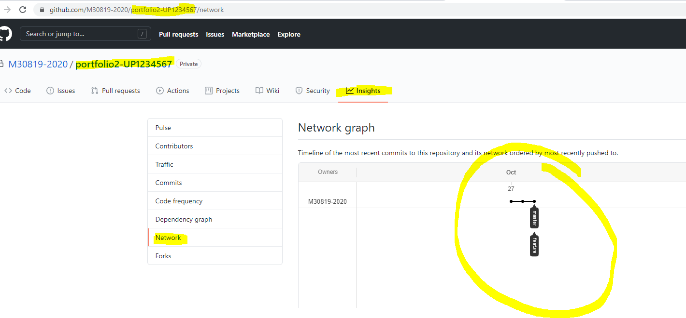

# **Software Engineering Theory and Practice**

|  School of Computing |  |
| --------------- | --------------- |
| Title | Software Engineering Theory and Practice |
| Module Coordinator| Steven Ossont|
| Email | steven.ossont@port.ac.uk|
| Code | M30819|
| Moodle | [https://moodle.port.ac.uk/course/view.php?id=11429](https://moodle.port.ac.uk/course/view.php?id=11429) |

## Schedule and Deliverables

| Item | Value | Format | Outcomes | Deadline |
| --- | --- | --- | --- | --- |
| Portfolio2 | 1% | GitHub Repo | Pass/Fail |  06 November 2020, 23:00 |

## Notes and Advice

<!-- markdown-link-check-disable -->
* The [Extenuating Circumstances procedure](https://www.upsu.net/advice) is
  there to support you if you have had any circumstances (problems) that have
  been serious or significant enough to prevent you from attending, completing
  or submitting an assessment on time.
* [ASDAC](http://www2.port.ac.uk/additional-support-and-disability-advice-centre/)
  are available to any students who disclose a disability or require additional
  support for their academic studies with a good set of resources on the [ASDAC
  Moodle site](https://moodle.port.ac.uk/course/view.php?id=3012)
* The University takes plagiarism seriously. Please ensure you adhere to the
  plagiarism guidelines [https://www.upsu.net/advice/plagiarism](https://www.upsu.net/advice/plagiarism).
* Any material included in your coursework should be
  fully cited and referenced in APA format (sixth edition). Detailed advice on
  referencing is available from [http://referencing.port.ac.uk/](http://referencing.port.ac.uk/)
* Any material submitted that does not meet format or submission guidelines, or
  falls outside of the submission deadline could be subject to a cap on your
  overall result or disqualification entirely.
* If you need additional assistance, you can ask your personal tutor, learning
  support ana.baker@port.ac.uk and xia.han@port.ac.uk or your lecturers.
<!-- markdown-link-check-enable-->

## Git commands

So far you have learnt the following git commands, if you are unclear what these are you MUST practice.

```lang-bash
git clone
git add
git pull
git commit
git push
```

And your trusted command, to help figure what is going on....

```lang-bash
git status
```

Please refresh your skills by reading the following:

* Clone: [https://git-scm.com/book/en/v2/Git-Basics-Getting-a-Git-Repository](https://git-scm.com/book/en/v2/Git-Basics-Getting-a-Git-Repository)

* Add, status, Commit [https://git-scm.com/book/en/v2/Git-Basics-Recording-Changes-to-the-Repository](https://git-scm.com/book/en/v2/Git-Basics-Recording-Changes-to-the-Repository)

Now we are going to learn some more git commands

## P2.1 Check your config

Check the following commands returns the correct value:

```lang-bash
git config --global user.name
```

It should return your github username, if not set it using

```lang-bash
git config --global user.name CorrectNameHere
```

On the Github.com settings page, ensure your **Public Profile** Name is set to your preferred name.

* This is NOT your Github Username, that should remain as your StudentID e.g. UP1234567
* The UP should be UPPERCASE -- if not change this now. (Read the discussion forum)
* This will help people know who you are and what to call you

You may want to set your commit email address.

```lang-bash
git config --global user.email
```

It should be the privacy email that you are given by GitHub. You can find this on you settings page under **Emails**

> Note this will NOT be your uni email (You don't want to make that public)

### Set your editor for messages (Not your code editor)

For example if you don't specify a message for a commit, you will be prompted to enter one using your default editor in the config.
This is probably not an editor you are familiar with, so **now** is the time to change this.

Test to see which editor opens up. (Ensure there is a change, do not add the `-m` parameter)

```lang-bash
git commit
```

Check what editor you have.

```lang-bash
git config --global core.editor
```

Here are some examples that you can use.
[https://www.atlassian.com/git/tutorials/setting-up-a-repository/git-config](https://www.atlassian.com/git/tutorials/setting-up-a-repository/git-config)

Change your editor. Here is how you would set this to notepad.

```lang-bash
git config --global core.editor "notepad.exe"
```

You will probably not like notepad that much (but is sure is easy to use) so experiment ....

```lang-bash
git config --global core.editor "code --wait"
```

Test to see if it works. (Does your editor pop up?)

```lang-bash
git commit
```

* Commit your change to this README file
* Put an X in the checklist to indicate the task is complete
* Commit and push your changes to GitHub

## P2.2 Create a markdown file

* Create a markdown file in the root of this repo with your StudentID as the name e.g. UP1234567.md
  * It must be uppercase -- or it won't get marked
* Edit your file to contain the following markdown

```lang-bash
# Git commands

## git clone

## git add

## git pull

## git commit

## git push

## git status

## git branch

## git merge

## git checkout

## Network Graph
```

* Commit your StudentID `.md` file
* Put an X in the checklist to indicate the task is complete
* Commit and push your changes to GitHub

## P2.3 Read how and why we might want to branch

[https://git-scm.com/book/en/v2/Git-Branching-Branches-in-a-Nutshell](https://git-scm.com/book/en/v2/Git-Branching-Branches-in-a-Nutshell)

[https://git-scm.com/book/en/v2/Git-Branching-Basic-Branching-and-Merging](https://git-scm.com/book/en/v2/Git-Branching-Basic-Branching-and-Merging)

Here is a really good tool to help you understand branches (and git)

[https://learngitbranching.js.org/](https://learngitbranching.js.org/)

Here is an alternative that you can just enter commands (Note it does not
take all the parameters and does not actually do anything other than
visualise the commands you type)

[https://git-school.github.io/visualizing-git/](https://git-school.github.io/visualizing-git/)

Make sure you understand these commands

```lang-bash
git branch
git checkout
git merge
```

* Put an X in the checklist to indicate the task is complete
* Commit and push your changes to GitHub

## P2.4 Create a branch, commit and merge

* Create a new branch called `feature-p2.4` (Case sensitive)
* Checkout the `feature-p2.4` branch

> You can tell which branch you are using by typing `git branch`

* Edit your StudentID markdown file to add some text below the main heading. For example:

```lang-bash
# Git commands

Here is a list of the git commands and how they work.
```

* Commit your change to your StudentID markdown file on the `feature-p2.4` branch
* Push your changes

> Since you do not have the branch on your remote (GitHub yet: you will need to add it)

```lang-bash
git push --set-upstream origin feature-p2.4
```

* Checkout the `main` branch (it may be called `master` or `main` -- check which one you have)
* Merge the change you made on the `feature-p2.4` branch into your `master` or `main` branch
* Push your commits

Your PDF in the build folder should be updated to reflect this change

* Check this as complete in your README file (Update the check box in this README file)
* Git commit

* Put an X in the checklist to indicate the task is complete
* Commit and push your changes to GitHub

## P2.5 Add a description to git commands

For EVERY heading in your StudentID markdown file do the following: (You will end up with many branches)

* Create a new branch (give it a sensible name e.g. feature-clonedescription)
* Checkout the new branch
* Edit your StudentID markdown file to add a description to the heading. You must do this on the new branch you just created. For example (The example is Markdown not a command)

```lang-bash
## git clone

If you want to get a copy of an existing Git repository use git clone
```

* Commit your change
* Checkout your `master` or `main` branch
* Merge your changes from the feature branch you just created into the  `master` or `main` branch
* Commit the changes to the  `master` or `main` branch
* Push (Check the push worked)

> You should end up with 8+ branches

* Put an X in the checklist to indicate the task is complete
* Commit and push your changes to GitHub

## P2.6 Add a network diagram

Github will show you a network graph of your branches.

* Goto this Portfolio repo on Github.com
* Click on `insights` (webpage)
* Select the `Network` tab (webpage)

The will show you the branches and commits, as a diagram.

Take a screen shot of your browser window (The whole window)

* It must include the URL of your repo
* It must show your branches clearly



Add this image to your StudentID markdown file. e.g. UP1234567.md,
under the `Network Graph` heading you created earlier.

* Ensure you network image appears in the build PDF
* Put an X in the checklist to indicate the task is complete
* Commit and push your changes to GitHub

<!--==============  Start:   Edit the Markdown above here  ================  -->

## Portfolio checklist

* [X] P2.1 Check your config
* [X] P2.2 Create a markdown file
* [X] P2.3 Read how and why we might want to branch
* [X] P2.4 Create a branch, commit and merge
* [X] P2.5 Add a description to git commands
* [X] P2.6 Add a network diagram
* [X] Completed (I am finished -- Put an X in this box if you are done)
<!--==============  END:   Edit the Markdown above here  ================  -->

## **Your repository will be copied for marking automatically at the coursework deadline.**
