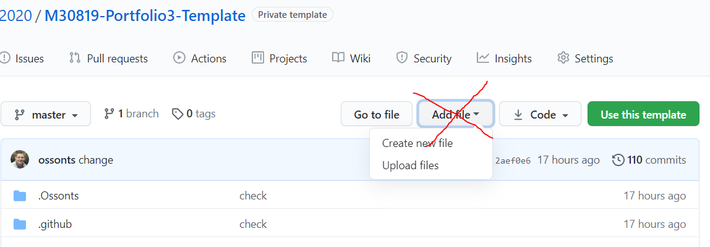

# **Software Engineering Theory and Practice**

|  School of Computing |  |
| --------------- | --------------- |
| Title | Software Engineering Theory and Practice |
| Module Coordinator| Steven Ossont|
| Email | steven.ossont@port.ac.uk|
| Code | M30819|
| Moodle | [https://moodle.port.ac.uk/course/view.php?id=11429](https://moodle.port.ac.uk/course/view.php?id=11429) |

## Schedule and Deliverables

| Item | Value | Format | Outcomes | Deadline |
| --- | --- | --- | --- | --- |
| Portfolio3 | 1% | GitHub Repo | Pass/Fail |  27 November 2020, 23:00 |

## Notes and Advice

<!-- markdown-link-check-disable -->
* The [Extenuating Circumstances procedure](https://www.upsu.net/advice) is
  there to support you if you have had any circumstances (problems) that have
  been serious or significant enough to prevent you from attending, completing
  or submitting an assessment on time.
* [ASDAC](http://www2.port.ac.uk/additional-support-and-disability-advice-centre/)
  are available to any students who disclose a disability or require additional
  support for their academic studies with a good set of resources on the [ASDAC
  Moodle site](https://moodle.port.ac.uk/course/view.php?id=3012)
* The University takes plagiarism seriously. Please ensure you adhere to the
  plagiarism guidelines [https://www.upsu.net/advice/plagiarism](https://www.upsu.net/advice/plagiarism).
* Any material included in your coursework should be
  fully cited and referenced in APA format (sixth edition). Detailed advice on
  referencing is available from [http://referencing.port.ac.uk/](http://referencing.port.ac.uk/)
* Any material submitted that does not meet format or submission guidelines, or
  falls outside of the submission deadline could be subject to a cap on your
  overall result or disqualification entirely.
* If you need additional assistance, you can ask your personal tutor, learning
  support ana.baker@port.ac.uk and xia.han@port.ac.uk or your lecturers.
<!-- markdown-link-check-enable-->

## Git commands

So far you have learnt the following git commands, if you are unclear what these are you MUST practice.

```lang-bash
git clone
git add
git pull
git commit
git push
git branch
git merge
git checkout
```

And your trusted command, to help figure what is going on....

```lang-bash
git status
```

> Your repository will be copied for marking automatically at the deadline.
> EDITS after the deadline are automatically ignored.

Files, external to this repo, e.g. Images imported via URL will be ignored (Even if they are stored in GitHub).

Large blocks of text that use the 'CODE' formatting will be ignored. This includes using triple \`\`\` (Unless it is code or something sensible).
If it looks like you are using \`\`\` to contain Markdown to avoid the lint checker, it will be ignored.

Here is a helpful link: [https://github.com/adam-p/markdown-here/wiki/Markdown-Cheatsheet#code](https://github.com/adam-p/markdown-here/wiki/Markdown-Cheatsheet#code)

At no point in this Assessment should you use the `Add file` button on the GitHub webpage -- Pretend it does not exist

> Clone, Edit, Commit, Push  (Preferably on the command line)



## Objective

The objective of this activity is to:

* Improve your Git/GitHub capability (command line)
  * You will need this for CW*
* Show that you can have artifacts in GitHub (GitHub artifacts)
  * Handy for your CW continuous integration (HINT)
* Produce a PDF from multiple Markdown files
  * You will need this on CW2 and it may help you with Git
* Understand that the warnings from actions need to be fixed
* Understand how to use issues

## P3.1 Create a markdown file and check the PDF build

You can generate any number of MD files for this Portfolio.

You are submitting the PDF that results by **YOU** running the `BuildPDF` action in GitHub

You have to list the `Markdown` files files that you want built into your PDF in the `.pandocFiles.yml` file. (See the notes in this file)

1. Remove the `Readme.md` from the `.pandocFiles.yml`
2. Create a new MD file `Portfolio3.md` and add some content e.g. `Hello World`
3. Ensure that the `CheckList.md` file remains the last item in the `.pandocFiles.yml` list.
4. Go to the github actions and run the BuildPDF action. This will generate you PDF artifact.
   An artifact can be viewed by clicking on the workflow action that was run. (Example screenshot below)
5. Download this artifact and check all your Markdown files are included in the PDF and that the order is correct. You will probably want to test this with multiple MD files at this point.
6. Commit the PDF that results from the `BuildPDF` action, into the Submit folder. (Do not change the file name, or alter the file contents)

> We will update this PDF later in this exercise

* The PDF in the Submit folder is the PDF that will be marked. It should be identical to the version from the `BuildPDF` action.
* It must be generated using the `BuildPDF` workflow
* You are responsible for committing this file it does not automatically update.
  * You must download the PDF artifact , check it and then commit it to the `Submit` folder
  * Remember no PDF = No marks.


By marking this section as completed you verify that you:

* can generate a PDF using the `BuildPDF` action
* can generate a PDF from multiple MD files in the correct order
* understand that you have to commit the **PDF into the submit folder yourself** when completed.
* understand there will be ONE PDF

Mark this as complete in the `CheckList.md`

Commit and Push

## P3.2 Understanding GitHub actions

The GitHub submission process is different for Portfolio3, you have to submit the PDF yourself, it is NOT automatic.
There are 3+ workflows enabled on your repo and you have
to run `BuildPDF` and `ValidateMarkdown` and `PortfolioChecker` manually
they are not automatic.

The badges below are experimental and should not be relied upon. They will indicate if the workflow has passed or if it is failing


To run a workflow:

1. Go to your repo on GitHub and click on the actions tab.
2. You will see the 3+ workflows (Do the following for each)
3. Select a Workflow e.g. `BuildPDF`
4. Click the `Run Workflow` button, select the branch you want it to run on (probably master or main)
5. You will see a list of all the times you have run a workflow. A red X indicates failing
6. You can click on the latest (Top) run of a workflow and see the tasks. Tasks with a red X are failing
7. Expand a failing task to see what is wrong


By marking this section as complete you understand that these badges only update when you run the workflow MANUALLY.
If the badge says you are passing, but you commit some failing code, you have to re-run the workflow to see that is is failing.

* You can get into a state where you see a passing badge (above) but you have failing code. You are unable to see you are failing as you did not rerun the workflow

Portfolio3 final submission **has** to pass the `BuildPDF` and `ValidateMarkdown` workflow to be counted as **submitted**.

The `PortfolioChecker` is experimental but will try to give you some hints if you are failing. You need to try and address all the issues that this workflow raises.

* Passing `PortfolioChecker` does not mean you will pass Portfolio3
* Failing `PortfolioChecker` probably means you will fail Portfolio3
* Common errors will be added to this workflow to help indicate issues

Update the `CheckList.md` file

* Put an X in the checklist to indicate the task is complete
* Commit and push your changes to GitHub

## P3.3 Python Hello World

Please write a Python programme that prints `Hello World`
This will be executed using:

```bash
python3 HelloWorld.py
```

The expected output is

```python
Hello World.
```

Update the `CheckList.md` file

* Put an X in the checklist to indicate the task is complete
* Commit and push your changes to GitHub

## P3.4 Objects

Python is an object oriented programming language.
Please make sure you make use of the `class` keyword.

Update the `CheckList.md` file

* Put an X in the checklist to indicate the task is complete
* Commit and push your changes to GitHub

## P3.5 Constructor

Python has an interesting syntax for a constructor

```python
__init__
```

Your `HelloWorld.py` code should have a constructor on the class

Update the `CheckList.md` file

* Put an X in the checklist to indicate the task is complete
* Commit and push your changes to GitHub

## P3.6 Help

When the `--help` parameter is supplied, your program should
output nothing but your StudentID (UPPERCASE e.g. `UP12234567`)

```bash
python3 HelloWorld.py --help
```

Update the `CheckList.md` file

* Put an X in the checklist to indicate the task is complete
* Commit and push your changes to GitHub

## P3.7 Make some new MD files

Locate the `Portfolio3.md` that you generated in P3.1 and delete any content.

In `Portfolio3.md` and in no more than 10 lines explain how your `HelloWorld.py` works.

* E.g. How to execute, input parameters, expected output

Create a new file `StudentID.md` and input your StudentID (UPPERCASE) and no other text

Create a new file `Code.md` and using the markdown backtick \`\`\`  copy
your `HelloWorld.py` into this file. It should be formatted using the code
capabilities of markdown (Look this up).

Update the `CheckList.md` file

* Put an X in the checklist to indicate the task is complete
* Commit and push your changes to GitHub

## P3.8 Build a PDF

Using what you learnt in P3.1 build the following Markdown files into
a single PDF using `BuildPDF`. (Order is important)

* `StudentID.md`
* `Portfolio3.md`
* `Code.md`

Download, check and validate the PDF artifact

Commit the PDF to the Submit folder

Update the `CheckList.md` file

* Put an X in the checklist to indicate the task is complete
* Commit and push your changes to GitHub

## P3.9 Issues

Check your GitHub for issues. If there are any please address the problem, then close the issue to acknowledge you have seen it.

> There is a BOT that runs and attempts to spot common errors before the deadline

Update the `CheckList.md` file

* Put an X in the checklist to indicate the task is complete
* Commit and push your changes to GitHub

## P3.10 Checklist

Complete the checklist (Make sure it is part of your PDF)

Get your latest PDF artifact (check it)

Commit the PDF that you want to submit into the `Submit` folder (Push the commit)

No PDF = No Marks

## **Your repository will be copied for marking automatically at the coursework deadline.**
