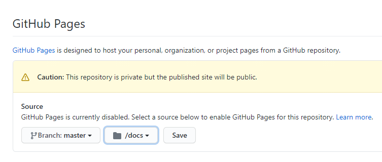

# **Software Engineering Theory and Practice**

|  School of Computing |  |
| --------------- | --------------- |
| Title | Software Engineering Theory and Practice |
| Module Coordinator| Steven Ossont|
| Email | steven.ossont@port.ac.uk|
| Code | M30819|
| Moodle | [https://moodle.port.ac.uk/course/view.php?id=11429](https://moodle.port.ac.uk/course/view.php?id=11429) |

## Schedule and Deliverables

| Item | Value | Format | Outcomes | Deadline |
| --- | --- | --- | --- | --- |
| Portfolio4 | 1% | GitHub Repo | Pass/Fail |  11 December 2020, 23:00 |

## Notes and Advice

<!-- markdown-link-check-disable -->
* The [Extenuating Circumstances procedure](https://www.upsu.net/advice) is
  there to support you if you have had any circumstances (problems) that have
  been serious or significant enough to prevent you from attending, completing
  or submitting an assessment on time.
* [ASDAC](http://www2.port.ac.uk/additional-support-and-disability-advice-centre/)
  are available to any students who disclose a disability or require additional
  support for their academic studies with a good set of resources on the [ASDAC
  Moodle site](https://moodle.port.ac.uk/course/view.php?id=3012)
* The University takes plagiarism seriously. Please ensure you adhere to the
  plagiarism guidelines [https://www.upsu.net/advice/plagiarism](https://www.upsu.net/advice/plagiarism).
* Any material included in your coursework should be
  fully cited and referenced in APA format (sixth edition). Detailed advice on
  referencing is available from [http://referencing.port.ac.uk/](http://referencing.port.ac.uk/)
* Any material submitted that does not meet format or submission guidelines, or
  falls outside of the submission deadline could be subject to a cap on your
  overall result or disqualification entirely.
* If you need additional assistance, you can ask your personal tutor, learning
  support ana.baker@port.ac.uk and xia.han@port.ac.uk or your lecturers.
<!-- markdown-link-check-enable-->

## Git commands

So far you have learnt the following git commands, if you are unclear what these are you MUST practice.

```shell
git clone
git add
git pull
git commit
git push
git branch
git merge
git checkout
```

And your trusted command, to help figure what is going on....

```shell
git status
```

> Your repository will be copied for marking automatically at the deadline.
> EDITS after the deadline are automatically ignored.

Files, external to this repo, e.g. Images imported via URL will be ignored (Even if they are stored in GitHub).

Large blocks of text that use the 'CODE' formatting will be ignored. This includes using triple \`\`\` (Unless it is code or something sensible).
If it looks like you are using \`\`\` to contain Markdown to avoid the lint checker, it will be ignored.

Here is a helpful link: [https://github.com/adam-p/markdown-here/wiki/Markdown-Cheatsheet#code](https://github.com/adam-p/markdown-here/wiki/Markdown-Cheatsheet#code)

At no point in this Assessment should you use the `Add file` button on the GitHub webpage -- Pretend it does not exist

> Clone, Edit, Commit, Push  (Preferably on the command line)


## Objectives

* To understand Markdown better (tables, images)
* To understand how the pandoc PDF builder works
* Gain skills for the CW[1-5] assessments
* To use and understand Github Pages

> HINT:  Your CW project will probably need a website, this may help address your needs

## P4.1 Enable GitHub Pages

You can use GitHub Pages to host a website directly from a GitHub repository.

You must enable GitHub Pages on **this** repo for it to work



Enable GitHub pages

* You must use `master` branch
* You must use the `docs` folder
* You have elevated permissions on this repo, please be careful

When enabled, you will get a website URL (e.g. `https://m30819-2020.github.io/portfolio4-UP1234567/`).

Create this file: `GitHubPages.url` on the root of your repo.and add the pages URL

* File name is case sensitive and must be on the root
* Content must be a single line containing a full URL to your pages site.
* No comments, new lines, or markdown

The content at this URL will be marked

Update the `CheckList.md` file

* Put an X in the checklist to indicate the task is complete
* Commit and push your changes to GitHub

## P4.2 (Optional) Use a custom domain name

Name.com will give a free domain to GitHub students. If you want you can sign up for a free domain and use your new domain in this exercise.

Information: [https://www.name.com/partner/github-students](https://www.name.com/partner/github-students)

Requirements: [https://docs.github.com/en/free-pro-team@latest/github/teaching-and-learning-with-github-education/applying-for-a-student-developer-pack](https://docs.github.com/en/free-pro-team@latest/github/teaching-and-learning-with-github-education/applying-for-a-student-developer-pack)

> Remember to update your `GitHubPages.url` file

Update the `CheckList.md` file

* Put an X in the checklist to indicate the task is complete
* Commit and push your changes to GitHub

## P4.3 Hello GitHub Pages

Create a markdown file `docs/README.md` and add the content

```markdown
# Hello GitHub Pages
```

* Check your website to see your new content (e.g. Reload the URL in `GitHubPages.url`)
* This will check your pages are set up properly

Update the `CheckList.md` file

* Put an X in the checklist to indicate the task is complete
* Commit and push your changes to GitHub

## P4.4 Pick a Theme

Change your GitHub repo settings


* Check your website URL to see your new theme (e.g. The URL in here `GitHubPages.url`)
* This will check your page theme is set up properly

## P4.5 Set and confirm the markdown flavour

In `docs/_config.yml` you can set the markdown flavour

1. Set it to GFM (You will probably need to add this line)

`markdown: GFM`

> GitHub pages supports two different markdown flavours `GitHub Flavoured Markdown (GFM)` and `Kramdown`. The examples we have done so far use `GFM`,
as there is no way to change this for markdown rendered in a GitHub repo.

Update the `CheckList.md` file

* Put an X in the checklist to indicate the task is complete
* Commit and push your changes to GitHub

## P4.6 Build a PDF

The Pandoc `PandocGenerator`  GitHub action will build the files listed in `.pandoc.yml` into a single PDF and commit a PDF to the build folder.

You **must** run the action `PandocGenerator` **manually**.

1. Add your `docs/README.md` and `Checklist.md` to the `.pandoc.yml` file (Only these 2 files)

> Note the pandoc PDF builder is slightly different than previous portfolios. Instead of using GFM as the input format, it now uses the generic `markdown` input format.
>This means that the PDF will be slightly different to the GitHub rendered version. It will now support multi-row tables and image resize.

Update the `CheckList.md` file

* Put an X in the checklist to indicate the task is complete
* Commit and push your changes to GitHub

## A hand tip for your group work

If you want to enable the generic `markdown` formatting on your **CW repo** you need to complete these 4 steps on your CW repo, e.g. CW2.

> Seek advice if unsrue

1. [BE CAREFUL HERE] Remove this line `from: gfm` from this file `.Ossonts/pandoc.yml`
2. [NOTE DIFFERENT FILE] Add this line `from: markdown` to this file `.pandoc.yml`
3. [BE CAREFUL HERE] Remove this line `pdf-engine: pdflatex` from this file `.Ossonts/pandoc.yml`
4. [NOTE DIFFERENT FILE] Add this line `pdf-engine: xelatex` to this file `.pandoc.yml`

## Recap

You now have a markdown file `docs/README.md` that

* renders into a website using GitHub Pages
* can also be built into a PDF and saved in the `build` folder [Manual action must be run]

## P4.7 Introduction to GitHub pages

Read and understand what GitHub pages are and what they can do:

Official : [https://pages.github.com/](https://pages.github.com/)

Guide: [https://docs.github.com/en/free-pro-team@latest/github/working-with-github-pages](https://docs.github.com/en/free-pro-team@latest/github/working-with-github-pages)

## P4.8 (Optional) Install Jekyll

GitHub Pages runs Jekyll on your Markdown file to produce static HTML pages. These appear as your website.

Developing a website this way can be slow when wanting to visualize changes.

You can run Jekyll locally on your machine, this will allow you to make changes to markdown pages and immediately see the change in your browser locally.

Perhaps try installing Jekyll locally? Some resources:

Window sub system: [https://www.vgemba.net/blog/Setup-Jekyll-WSL/](https://www.vgemba.net/blog/Setup-Jekyll-WSL/)

Plenty of config options: [https://jekyllrb.com/docs/configuration/options/](https://jekyllrb.com/docs/configuration/options/)

## 4.9 Add a simple python *application*

Create a python script, it will be executed using:

```shell
python3 HelloWorld.py
```

It must **exactly** return this **one** line:

```shell
Hello Portfolio 4
```

> You may use code from another Portfolio

Update the `CheckList.md` file

* Put an X in the checklist to indicate the task is complete
* Commit and push your changes to GitHub

## P4.10 Syntax highlighting

Add your code from `HelloWorld.py` as a snipit to your website markdown. Use the level 2 heading `## Code`.

If you include code / scripts in Markdown please tag them with the appropriate type so the syntax highlights properly

[http://www.rubycoloredglasses.com/2013/04/languages-supported-by-github-flavored-markdown/](http://www.rubycoloredglasses.com/2013/04/languages-supported-by-github-flavored-markdown/)

For example :

## Code

```python
"""
This is a
multiline docstring.
"""
print("Hello, World!")
```

Update the `CheckList.md` file

* Put an X in the checklist to indicate the task is complete
* Commit and push your changes to GitHub

## P4.11 Add a table with long lines of text

Wrapping long lines of text in markdown tables can be problematic.

Markdown does not support all the features we may need e.g. Table captions.

Here is an example that renders okay

: This is a table caption that wont render in GFM but will end up in your PDF as a caption

| Table with a long line of text  |
|----------|
| *The quick brown fox jumps over the lazy dog* is an English-language pangram -- a sentence that contains all of the letters of the English alphabet. Owing to its brevity and coherence, it has become widely known. The phrase is commonly used for touch-typing practice, testing typewriters and computer keyboards, displaying examples of fonts, and other applications involving text where the use of all letters in the alphabet is desired.|
|This will look good in GFM and fine in your PDF|

* This will render as GFM on a webpage and look okay
* If you are using the `markdown` option in pandoc (not `GFM`) this will build into a PDF
* If you render your GitHub pages with Kramdown this will render okay

1) Create a level 2 heading `Overview` section in your website markdown file, **above** the `Code` section
2) Add a table to the `Overview` section. Describe your Python code, here are some suggested columns.

* Column `Description` (The table must have a multi line entry)
* Column `Example usage`
* Column `Expected output`

Update the `CheckList.md` file

* Put an X in the checklist to indicate the task is complete
* Commit and push your changes to GitHub

## P4.12 Display and resize an image

* GFM does not support image resize
* You probably don't need to resize on GitHub Pages as the generated HTML looks okay
* You probably need resize for pandoc PDF generation
* One trick is to put images in a table

: This is a table caption that wont render in GFM but will end up in your PDF

| Table with a long line of text | Image 1 | Image 2 |
|------|-------:|-------:|
|  *The quick brown fox jumps over the lazy dog* is an English-language pangram -- a sentence that contains all of the letters of the English alphabet. Owing to its brevity and coherence, it has become widely known. The phrase is commonly used for touch-typing practice, testing typewriters and computer keyboards, displaying examples of fonts, and other applications involving text where the use of all letters in the alphabet is desired.  |      |      |

Another way is to add a width parameter to the image markdown e.g.

`{width=50px}`

Here are 3 images with different sizes

{width=30px}

{width=60px}

{width=90px}

This will cause `{width=50px}` to appear on your GFM rendered pages, but will be used in the PDF to resize the images (Handy for CW).

1. Create an image of your GitHub Pages website showing the theme you have selected.
2. Display the image in a table under a level 2 heading `Table example`
3. Display the image in 3 different sizes under a level 2 heading `Resize example` [NOTE this will only look okay in the PDF]

Update the `CheckList.md` file

* Put an X in the checklist to indicate the task is complete
* Commit and push your changes to GitHub

## Table Alignment

You can align text in the columns to the left, right, or center by adding a colon (:) to the left, right, or on both side of the hyphens within the header row.

```markdown
| Syntax      | Description | Test Text     |
| :---        |    :----:   |          ---: |
| Header      | Title       | Here's this   |
| Paragraph   | Text        | And more      |
```

: Example table alignment

| Syntax      | Description | Test Text     |
| :---        |    :----:   |          ---: |
| Header      | Title       | Here's this   |
| Paragraph   | Text        | And more      |

Further reading [https://www.markdownguide.org/extended-syntax/](https://www.markdownguide.org/extended-syntax/)

## P4.13 Student ID

Create a file called  `Student.ID` on the root of your repo

Add your student ID to this text file e.g. UP1234567

* You need the `UP`
* Case sensitive
* One line ONLY
* The `Student.ID` file should contain only your ID

The first alpha numeric word on the first line will be used as your ID.
Incorrect information can result in 0%

Update the `CheckList.md` file

* Put an X in the checklist to indicate the task is complete
* Commit and push your changes to GitHub

<!--
## Kramdown

[https://kramdown.gettalong.org/](https://kramdown.gettalong.org/)[https://kramdown.gettalong.org/](https://kramdown.gettalong.org/)

syntax
[https://kramdown.gettalong.org/syntax.html](https://kramdown.gettalong.org/syntax.html)

images
[https://kramdown.gettalong.org/syntax.html#images](https://kramdown.gettalong.org/syntax.html#images) -->

<!-- rm auto action build -->

## P4.14 Issues

Check your GitHub for issues. If there are any please address the problem, then close the issue to acknowledge you have seen it.

> There is a BOT that runs and attempts to spot common errors before the deadline

Update the `CheckList.md` file

* Put an X in the checklist to indicate the task is complete
* Commit and push your changes to GitHub

## P4.15 Checklist

Complete the checklist (Make sure it is part of your PDF)

Check the PDF that you want to submit is in the `build` folder [Manually run the GitHub action]

No PDF = No Marks

You must run and pass these actions:


Update the `CheckList.md` file

* Put an X in the checklist to indicate the task is complete
* Commit and push your changes to GitHub

## **Your repository will be copied for marking automatically at the coursework deadline.**
