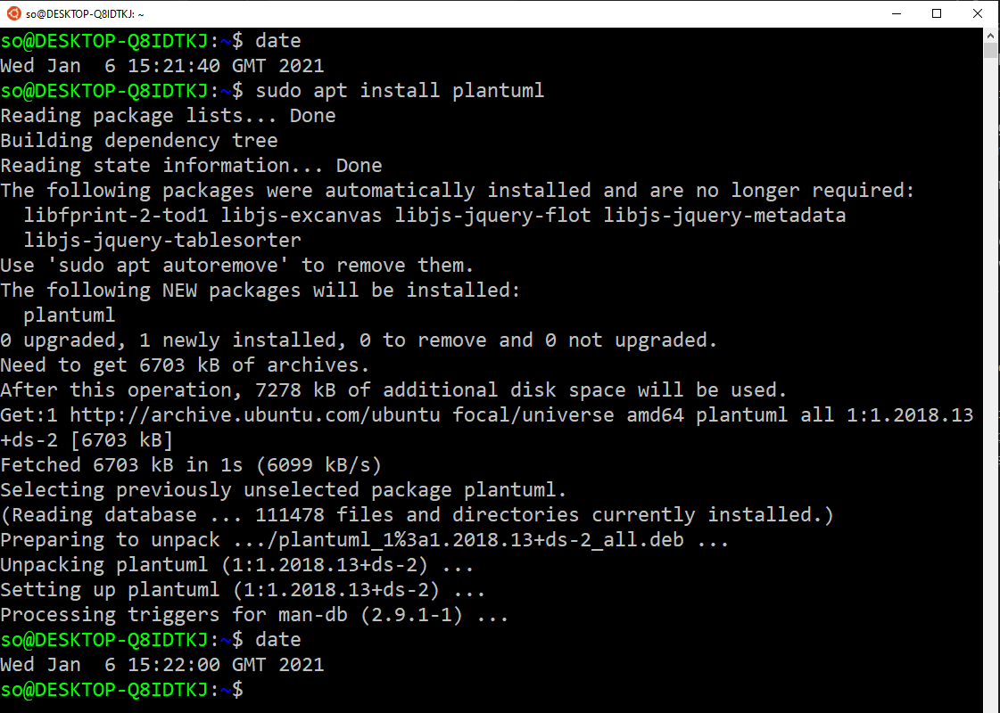
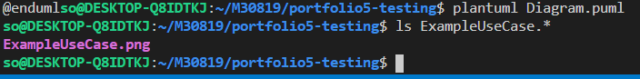
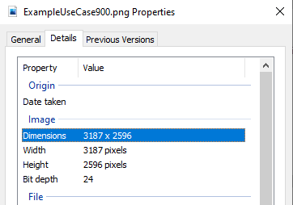

# **Software Engineering Theory and Practice**

|  School of Computing |  |
| --------------- | --------------- |
| Title | Software Engineering Theory and Practice |
| Module Coordinator| Steven Ossont|
| Email | steven.ossont@port.ac.uk|
| Code | M30819|
| Moodle | [https://moodle.port.ac.uk/course/view.php?id=11429](https://moodle.port.ac.uk/course/view.php?id=11429) |

## Schedule and Deliverables

> Suggested deadline, **22 January 2021, 23:00**. Please consider submitting on or before this date and **only** use the extension if REQUIRED.

| Item | Value | Format | Outcomes | Deadline |
| --- | --- | --- | --- | --- |
| Portfolio5 | 1% | GitHub Repo | Pass/Fail |  03 February 2021, 23:00 |

> Suggested deadline, **22 January 2021, 23:00**. Please consider submitting on or before this date and **only** use the extension if REQUIRED.

## Notes and Advice

<!-- markdown-link-check-disable -->
* The [Extenuating Circumstances procedure](https://myport.port.ac.uk/my-course/extenuating-circumstances ) is
  there to support you if you have had any circumstances (problems) that have
  been serious or significant enough to prevent you from attending, completing
  or submitting an assessment on time.
* The UNION Extenuating Circumstances [Extenuating Circumstances procedure](https://upsu.net/advice/academic-advice/extenuating-circumstances)
* [ASDAC](https://myport.port.ac.uk/guidance-and-support/additional-support-and-disability-advice )
  are available to any students who disclose a disability or require additional
  support for their academic studies with a good set of resources on the [ASDAC
  Moodle site](https://moodle.port.ac.uk/course/view.php?id=3012)
* The University takes plagiarism seriously. Please ensure you adhere to the
  plagiarism guidelines.
Examination Regulations ([http://regulations.docstore.port.ac.uk/ExamRegs12AssessmentOffences.pdf](http://regulations.docstore.port.ac.uk/ExamRegs12AssessmentOffences.pdf)).
* Any material included in your coursework should be
  fully cited and referenced in APA format (seventh edition). Detailed advice on
  referencing is available from [http://referencing.port.ac.uk/](http://referencing.port.ac.uk/)
* Any material submitted that does not meet format or submission guidelines, or
  falls outside of the submission deadline could be subject to a cap on your
  overall result or disqualification entirely.
* If you need additional assistance, you can ask your personal tutor, learning
  support ana.baker@port.ac.uk and xia.han@port.ac.uk or your lecturers.
<!-- markdown-link-check-enable-->

## Git commands

So far you have learnt the following git commands, if you are unclear what these are you MUST practice. You are expected to know them and how to use them without explanation.

```shell
git clone
git add
git pull
git commit
git push
git branch
git merge
git checkout
```

And your trusted command, to help figure what is going on....

```shell
git status
```

> Your repository will be copied for marking automatically at the deadline.
> EDITS after the deadline are automatically ignored.

When you update the `CheckList.md` file. This will trigger an action to inspect the work for this part of the Portfolio.(You can also manually run the `PortfolioChecker` if you need to see if changes solve any errors)

Files, external to this repo and any images imported via URL will be ignored (Even if they are stored in GitHub).

Large blocks of text that use the 'CODE' formatting will be ignored. This includes using triple \`\`\` (Unless it is code or something sensible).
If it looks like you are using \`\`\` to contain Markdown to avoid the lint checker, it will be ignored.
Code blocks should be labeled with the code language so that the syntax highlighter is enabled.

Here is a helpful Markdown link: [https://github.com/adam-p/markdown-here/wiki/Markdown-Cheatsheet#code](https://github.com/adam-p/markdown-here/wiki/Markdown-Cheatsheet#code)

At no point in this Assessment should you use the `Add file` button on the GitHub webpage -- Pretend it does not exist

Marking is performed on a Ubuntu machine. This means that everything is case sensitive, where it may not be on Windows.

> Clone, Edit, Commit, Push  (Preferably on the command line)


## Objectives

* 100% valid Student ID success rate for the whole class. (Incorrect or absent Student ID = 0% no exceptions)
* Install PlantUML
* Draw a diagram
* Refresh your memory of Git commands
* Understand SVG and PNG image files

> The process is **different** this time, there is more error checking in the GitHub Actions, You must watch the output for errors/warning. If you have problems or suspect an error, please screenshot and open an issue.

## Portfolio 5 Part 1

> Suggested deadline, **22 January 2021, 23:00**. Please consider submitting on or before this date and **only** use the extension if REQUIRED.

Create a file with the filename `Student.ID`, add your Student ID to the content of this file. Note:

* Invalid ID = No marks
* The file extension is `.ID` other file extensions e.g. `.txt` are not permitted
* The content of the file should be your ID ONLY, e.g. `UP1234567`
* You need the `UP`
* Filename is case sensitive
* File contents are case sensitive
* File should contain one line ONLY
* Markdown formatting is NOT permitted e.g. `*` or `-`

<!-- Save, Commit -->

When you have completed this part of the portfolio update the `CheckList.md` file. This will trigger an action to inspect the work for this part of the Portfolio. [You can also manually trigger the `PortfolioChecker` action]

* Add any files that are needed for this part  (if any), to your GitHub repo E.g. new files that you created
* Put an `X` in the `CheckList.md` to indicate the task is complete
* Commit and **push** your changes to GitHub
* Navigate to the `PortfolioChecker` action on GitHub.com and read the feedback / errors / comments
* Be sure to address any errors
* You do not need to wait for the `PortfolioChecker` to complete if it is running slow. Proceed and come back and look at the checker errors/warnings when it completes.

<!-- Save, Commit -->

## Portfolio 5 Part 2

PlantUML will let you draw UML diagrams. All UML diagrams in CW3 will need to be done in PlantUML. This is your opportunity to understand how it works.

PlantUML does not have a beautiful webpage, but it is a very powerful tool

[https://plantuml.com/](https://plantuml.com/)

* Install PlantUML on your machine
* You **must** use the local install of PlantUML, i.e. do not use a remote server (Default in VS Code plugin is to use a remote server)
* There are may ways to install plantuml, but so long you can generate images locally you will be fine

Here is the install page [https://plantuml.com/faq-install](https://plantuml.com/faq-install)

I suggest you try this **first**:

* WSL / Ubuntu 20.04, package manager has this:
  * `sudo apt install plantuml`

* VS code has a plugin , but you will need to configure it so it does not use a remote server.
  * [https://github.com/qjebbs/vscode-plantuml](https://github.com/qjebbs/vscode-plantuml)

> This should not be an arduous task, come to a drop-in or discuss on discord if you are having issues.

Here is the install on Ubuntu 20.04 on Windows WSL taking 20 seconds


<!-- Save, Commit -->

When you have completed this part of the portfolio update the `CheckList.md` file. This will trigger an action to inspect the work for this part of the Portfolio. [You can also manually trigger the `PortfolioChecker` action]

* Add any files that are needed for this part  (if any), to your GitHub repo E.g. new files that you created
* Put an `X` in the `CheckList.md` to indicate the task is complete
* Commit and **push** your changes to GitHub
* Navigate to the `PortfolioChecker` action on GitHub.com and read the feedback / errors / comments
* Be sure to address any errors
* You do not need to wait for the `PortfolioChecker` to complete if it is running slow. Proceed and come back and look at the checker errors/warnings when it completes.

<!-- Save, Commit -->

## Portfolio 5 Part 3

On the root of this repo there is an example PlantUML file: `Diagram.puml`. This file contains a single Use Case diagram. (A file can contain multiple diagrams)

It comes from a very useful website (Diagram 5109034055106560) [https://real-world-plantuml.com/?type=usecase](https://real-world-plantuml.com/?type=usecase)

> This resource will be handy for the CW, but be sure not to plagiarize.

You will need to execute PlantUML on this file to output a PNG image file.



This is not ideal as you did not say where the output image file should be located; PNG output is the default, but what if you wanted a different image format?

There are lots of commandline options: [https://plantuml-documentation.readthedocs.io/en/latest/command_line_reference.html](https://plantuml-documentation.readthedocs.io/en/latest/command_line_reference.html)

Execute your plantUML command using the `-tpng` option and the  `-output` directory option.

You must end up with a PNG file generated by PlantUML in the `images` folder of this repo. (It will be called `ExampleUseCase.png` , case sensitive)

> Note in the example `Diagram.puml`, the output image filename is located at the first line, this way you can have have multiple diagrams in a single file. And bulk convert them into images, with the same command.

In the  `Diagram.puml`  file, line one starts the UML diagram start command and gives the filename `ExampleUseCase`. Note there is no file extension.

<!-- markdownlint-disable fenced-code-language -->
```
@startuml ExampleUseCase
```
<!-- markdownlint-enable fenced-code-language -->

1. Git add the `ExampleUseCase.png` file that results from this task. (Must be in `images` folder)
2. Take a `png` screen shot of your process that resulted in this file being generated. E.g. The commandline/shell window. Git add this image to the `images` folder and give it the filename `GeneratingExampleUseCase.png` (Case sensitive).

<!-- Save, Commit -->

When you have completed this part of the portfolio update the `CheckList.md` file. This will trigger an action to inspect the work for this part of the Portfolio. [You can also manually trigger the `PortfolioChecker` action]

* Add any files that are needed for this part  (if any), to your GitHub repo E.g. new files that you created
* Put an `X` in the `CheckList.md` to indicate the task is complete
* Commit and **push** your changes to GitHub
* Navigate to the `PortfolioChecker` action on GitHub.com and read the feedback / errors / comments
* Be sure to address any errors
* You do not need to wait for the `PortfolioChecker` to complete if it is running slow. Proceed and come back and look at the checker errors/warnings when it completes.

<!-- Save, Commit -->

## Portfolio 5 Part 4

In Part 3, you generated a `png` using PlantUML. The default image resolution is rather low, and not ideal for including in a PDF (e.g. Coursework submissions).

You can increase the resolution by using the `skinparam` command. [https://plantuml.com/skinparam](https://plantuml.com/skinparam)

It is easiest to add the skinparam to your diagram.

1. In the `Diagram.puml` duplicate the existing
**contents** into the **same** file.

   * The file has one diagram in it, we are copying to make two diagrams.

   * For this step copy the file contents and then paste them below the existing content.
   * You should end up with the original content repeated.

   Do not alter the first diagram. It works and we are happy with it.

   > Ask if you are stuck here. Don't guess or assume.

2. Change the **output** file name for the **second** diagram from `ExampleUseCase` to `ExampleUseCase900`. (Do not rename the `Diagram.puml` file, you are changing the file contents here)

3. Change the output resolution for the **second** diagram to 900 dpi

   * You may want to consider using the `skinparam dpi` command to set the resolution of the second image in `Diagram.puml` to `900 dpi`.

4. Run PlantUML on the `Diagram.puml` file with the output going to the `images` folder and the image type as `png`.
   * This will now generate **two** images `ExampleUseCase.png` and `ExampleUseCase900.png`. You will need these 2 files.

5. Save an image called `ExampleUseCase900Resolution.png`, into your `images` folder. It must clearly show the resolution of the `ExampleUseCase900.png` file.
   * You can use any tooling you want
   * It must show the resolution
   * It must show the filename
   * The resolution must be higher than the default
   * E.g. You can run PlantUML with the `-v` option to see the file output details
   * E.g You can use the `OS` properties (see below)

   

<!-- Save, Commit -->

When you have completed this part of the portfolio update the `CheckList.md` file. This will trigger an action to inspect the work for this part of the Portfolio. [You can also manually trigger the `PortfolioChecker` action]

* Add any files that are needed for this part  (if any), to your GitHub repo E.g. new files that you created
* Put an `X` in the `CheckList.md` to indicate the task is complete
* Commit and **push** your changes to GitHub
* Navigate to the `PortfolioChecker` action on GitHub.com and read the feedback / errors / comments
* Be sure to address any errors
* You do not need to wait for the `PortfolioChecker` to complete if it is running slow. Proceed and come back and look at the checker errors/warnings when it completes.

<!-- Save, Commit -->

## Portfolio 5 Part 5

In part 4 we generated two `png` images; a low and a high resolution image. Compare the two; resolution is important when generating documents.

> This is a tip for your Coursework

One type of images, uses a series of dots (pixels) to build up an image. For these images to look good, you need a lot of dots. The more dots the bigger the file.

A better way to draw an image is to use vectors. Instead of using dots (pixels) you could, for example describe a line as having a start and stop location and then describe the line. This is a much better way to store images. Vector graphics should be your preferred option.

PlantUML supports Scalable Vector Graphics (SVG). [https://en.wikipedia.org/wiki/Scalable_Vector_Graphics](https://en.wikipedia.org/wiki/Scalable_Vector_Graphics)

You should not need to edit the diagram file contents.

1. By changing the Plantuml configuration/commandline, output your images as `SVG`.
   * Images should go to the images folder
   * The generated files should be called `ExampleUseCase.svg` and `ExampleUseCase900.svg` (You should not have to alter the file names)

2. Zoom in on the PNG and the SVG images
3. Look at the file size of each image

<!-- Save, Commit -->

When you have completed this part of the portfolio update the `CheckList.md` file. This will trigger an action to inspect the work for this part of the Portfolio. [You can also manually trigger the `PortfolioChecker` action]

* Add any files that are needed for this part  (if any), to your GitHub repo E.g. new files that you created
* Put an `X` in the `CheckList.md` to indicate the task is complete
* Commit and **push** your changes to GitHub
* Navigate to the `PortfolioChecker` action on GitHub.com and read the feedback / errors / comments
* Be sure to address any errors
* You do not need to wait for the `PortfolioChecker` to complete if it is running slow. Proceed and come back and look at the checker errors/warnings when it completes.

<!-- Save, Commit -->

## Portfolio 5 Part 6

1. Create a file called `PlantUML.md`

2. Add the following, in order, to your `PlantUML.md`. Use markdown **headings**; tables if needed; image captions; formatting and appearance are important.

* File contents of: `Diagram.puml`, formatted as a fenced code block in markdown
* Image: `ExampleUseCase.png`, with caption
* Image: `GeneratingExampleUseCase.png` , with caption
* Image: `ExampleUseCase900.png`, with caption
* Image: `ExampleUseCase900Resolution.png`, with caption
* Image: `ExampleUseCase.svg` , with caption
* Image: `ExampleUseCase900.svg`, with caption

You may also want to add some notes, comments, descriptions so that this document can remind you how to use PlantUML. For example, later on for your CW.

<!-- Save, Commit -->

When you have completed this part of the portfolio update the `CheckList.md` file. This will trigger an action to inspect the work for this part of the Portfolio. [You can also manually trigger the `PortfolioChecker` action]

* Add any files that are needed for this part  (if any), to your GitHub repo E.g. new files that you created
* Put an `X` in the `CheckList.md` to indicate the task is complete
* Commit and **push** your changes to GitHub
* Navigate to the `PortfolioChecker` action on GitHub.com and read the feedback / errors / comments
* Be sure to address any errors
* You do not need to wait for the `PortfolioChecker` to complete if it is running slow. Proceed and come back and look at the checker errors/warnings when it completes.

<!-- Save, Commit -->

## Portfolio 5 Part 7

We are now going to pull together all your outputs into a single PDF.

You should use the `PandocGenerator` GitHub action to build the PDF.

* This action must be run manually. The action will commit a PDF to your build folder.

* You must inspect this PDF to ensure that all the text is visible; correctly formatted; and all images are captioned and complete.

* All generated markdown must pass the `ValidateMarkdown` action. You have to run the checker manually, it does **not** run automatically on a commit/push.

Add the following files to your `.pandoc.yml`. Do not include the `README.md` in your PDF/pandoc file. Order is important.

* `PlantUML.md`
* `CheckList.md`
* `Student.ID`

Read, check and validate your PDF.

<!-- Save, Commit -->

When you have completed this part of the portfolio update the `CheckList.md` file. This will trigger an action to inspect the work for this part of the Portfolio. [You can also manually trigger the `PortfolioChecker` action]

* Add any files that are needed for this part  (if any), to your GitHub repo E.g. new files that you created
* Put an `X` in the `CheckList.md` to indicate the task is complete
* Commit and **push** your changes to GitHub
* Navigate to the `PortfolioChecker` action on GitHub.com and read the feedback / errors / comments
* Be sure to address any errors
* You do not need to wait for the `PortfolioChecker` to complete if it is running slow. Proceed and come back and look at the checker errors/warnings when it completes.

<!-- Save, Commit -->

## Portfolio 5 Part 8

Complete the checklist. Put an X in the checklist to indicate the task is complete. (Make sure it is part of your PDF)

Check the PDF that you want to submit is in the `build` folder [Manually run the GitHub action]

No PDF = No Marks

You must run and pass these actions [**Run these actions manually now**]:


[Banners above are EXPERIMENTAL; do not rely on them]

* Commit and push your changes to GitHub

## **Your repository will be copied for marking automatically at the coursework deadline OR when the Completed checklist item is ticked; whichever is earliest**
