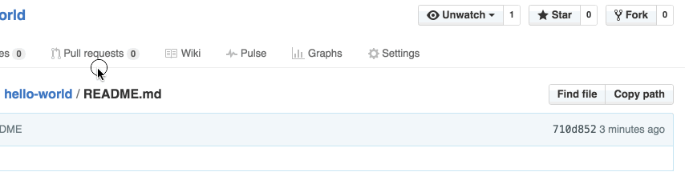
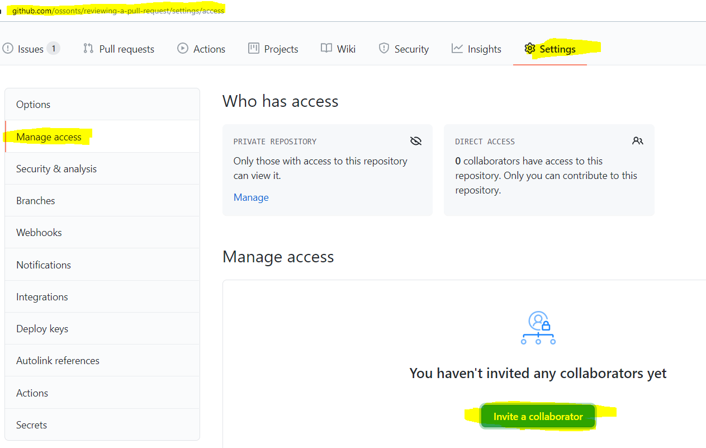

# **Software Engineering Theory and Practice**

|  School of Computing |  |
| --------------- | --------------- |
| Title | Software Engineering Theory and Practice |
| Module Coordinator| Steven Ossont|
| Email | steven.ossont@port.ac.uk|
| Code | M30819|
| Moodle | [https://moodle.port.ac.uk/course/view.php?id=11429](https://moodle.port.ac.uk/course/view.php?id=11429) |

## Schedule and Deliverables

| Item | Value | Format | Outcomes | Deadline |
| --- | --- | --- | --- | --- |
| Portfolio6 | 1% | GitHub Repo | Pass/Fail |  03 February 2021, 23:00 |

## Notes and Advice

<!-- markdown-link-check-disable -->
* The [Extenuating Circumstances procedure](https://myport.port.ac.uk/my-course/extenuating-circumstances ) is
  there to support you if you have had any circumstances (problems) that have
  been serious or significant enough to prevent you from attending, completing
  or submitting an assessment on time.
* The UNION Extenuating Circumstances [Extenuating Circumstances procedure](https://upsu.net/advice/academic-advice/extenuating-circumstances)
* [ASDAC](https://myport.port.ac.uk/guidance-and-support/additional-support-and-disability-advice )
  are available to any students who disclose a disability or require additional
  support for their academic studies with a good set of resources on the [ASDAC
  Moodle site](https://moodle.port.ac.uk/course/view.php?id=3012)
* The University takes plagiarism seriously. Please ensure you adhere to the
  plagiarism guidelines.
Examination Regulations ([http://regulations.docstore.port.ac.uk/ExamRegs12AssessmentOffences.pdf](http://regulations.docstore.port.ac.uk/ExamRegs12AssessmentOffences.pdf)).
* Any material included in your coursework should be
  fully cited and referenced in APA format (seventh edition). Detailed advice on
  referencing is available from [http://referencing.port.ac.uk/](http://referencing.port.ac.uk/)
* Any material submitted that does not meet format or submission guidelines, or
  falls outside of the submission deadline could be subject to a cap on your
  overall result or disqualification entirely.
* If you need additional assistance, you can ask your personal tutor, learning
  support ana.baker@port.ac.uk and xia.han@port.ac.uk or your lecturers.
<!-- markdown-link-check-enable-->

## Git commands

So far you have learnt the following git commands, if you are unclear what these are you MUST practice. You are expected to know them and how to use them without explanation.

```shell
git clone
git add
git pull
git commit
git push
git branch
git merge
git checkout
```

And your trusted command, to help figure what is going on....

```shell
git status
```

> Your repository will be copied for marking automatically at the deadline.
> EDITS after the deadline are automatically ignored.

When you update the `CheckList.md` file. This will trigger an action to inspect the work for this part of the Portfolio.(You can also manually run the `PortfolioChecker` if you need to see if changes solve any errors)

Files, external to this repo and any images imported via URL will be ignored (Even if they are stored in GitHub).

Large blocks of text that use the 'CODE' formatting will be ignored. This includes using triple \`\`\` (Unless it is code or something sensible).
If it looks like you are using \`\`\` to contain Markdown to avoid the lint checker, it will be ignored.
Code blocks should be labeled with the code language so that the syntax highlighter is enabled.

Here is a helpful Markdown link: [https://github.com/adam-p/markdown-here/wiki/Markdown-Cheatsheet#code](https://github.com/adam-p/markdown-here/wiki/Markdown-Cheatsheet#code)

At no point in this Assessment should you use the `Add file` button on the GitHub webpage -- Pretend it does not exist

Marking is performed on a Ubuntu machine. This means that everything is case sensitive, where it may not be on Windows.

> Clone, Edit, Commit, Push  (Preferably on the command line)


## Objectives

* 100% valid Student ID success rate for the whole class. (Incorrect or absent Student ID = 0% no exceptions)
* Understand Pull Requests
* Complete a pull request
* Learn enough about Git pull requests to complete CW[3,4] (Code)

> The process is **different** this time, there is more error checking in the GitHub Actions, You must watch the output for errors/warning. If you have problems or suspect an error, please screenshot and open an issue.

## Portfolio 6 Part 1

> Suggested deadline, **29 January 2021, 23:00**. Please consider submitting on or before this date and **only** use the extension if REQUIRED.

Create a file with the filename `Student.id`, add your Student ID to the content of this file. Note:

* Invalid ID = No marks
* The file extension is `.id` other file extensions e.g. `.txt` are not permitted
* The content of the file should be your ID ONLY, e.g. `UP1234567`
* You need the `UP`
* Filename is case sensitive
* File contents are case sensitive
* File should contain one line ONLY
* Markdown formatting is NOT permitted e.g. `*` or `-`

<!-- Save, Commit -->

When you have completed this part of the portfolio update the `CheckList.md` file. This will trigger an action to inspect the work for this part of the Portfolio. [You can also manually trigger the `PortfolioChecker` action]

* Add any files that are needed for this part  (if any), to your GitHub repo E.g. new files that you created
* Put an `X` in the `CheckList.md` to indicate the task is complete
* Commit and **push** your changes to GitHub
* Navigate to the `PortfolioChecker` action on GitHub.com and read the feedback / errors / comments
* Be sure to address any errors
* You do not need to wait for the `PortfolioChecker` to complete if it is running slow. Proceed and come back and look at the checker errors/warnings when it completes.

<!-- Save, Commit -->

## Portfolio 6 Part 2

Please ensure that you read the required documentation and watch the associated videos. You will be unable to complete the Portfolio if you do not understand `Pull Requests`.

Watch this: [https://www.youtube.com/watch?v=For9VtrQx58](https://www.youtube.com/watch?v=For9VtrQx58)

Other sources of information that you may wish to read:

* [https://git-scm.com/book/en/v2/GitHub-Maintaining-a-Project](https://git-scm.com/book/en/v2/GitHub-Maintaining-a-Project)
[https://yangsu.github.io/pull-request-tutorial/](https://yangsu.github.io/pull-request-tutorial/)
* [https://docs.github.com/en/github/collaborating-with-issues-and-pull-requests/about-pull-requests](https://docs.github.com/en/github/collaborating-with-issues-and-pull-requests/about-pull-requests)
* [https://www.atlassian.com/git/tutorials/making-a-pull-request](https://www.atlassian.com/git/tutorials/making-a-pull-request)

( Parts of this portfolio are based on [https://guides.github.com/activities/hello-world/](https://guides.github.com/activities/hello-world/) -- worth looking at)

<!-- Save, Commit -->

When you have completed this part of the portfolio update the `CheckList.md` file. This will trigger an action to inspect the work for this part of the Portfolio. [You can also manually trigger the `PortfolioChecker` action]

* Add any files that are needed for this part  (if any), to your GitHub repo E.g. new files that you created
* Put an `X` in the `CheckList.md` to indicate the task is complete
* Commit and **push** your changes to GitHub
* Navigate to the `PortfolioChecker` action on GitHub.com and read the feedback / errors / comments
* Be sure to address any errors
* You do not need to wait for the `PortfolioChecker` to complete if it is running slow. Proceed and come back and look at the checker errors/warnings when it completes.

<!-- Save, Commit -->

## Portfolio 6 Part 3

1. Create a new Branch

   * Make sure you call this branch `bug-hello`

> For *your* CW code repo read [https://gist.github.com/digitaljhelms/4287848](https://gist.github.com/digitaljhelms/4287848)

By default your repository has one branch named `main` which is considered to be the definitive branch. We use branches to experiment and make edits before committing them to `main`.

When you create a branch off the `main` branch, you’re making a copy, or snapshot, of `main` as it was at that point in time. If someone else made changes to the `main` branch while you were working on your branch, you could pull in those updates.

> Please revisit the branch and merge Portfolio if you are uncertain here.


This diagram shows:

* The `main` branch
* A new branch called `feature` (because we’re doing feature work on this branch -- best to name this after the function of the feature in real projects)
* The journey that feature takes before it is merged into `main`

> Use branches for keeping bug fixes and feature work separate from the `main` (production) branch. When a change is ready, merge the branch into `main`.

* Commit and push your new branch to GitHub
* Your branch must be visible on GitHub.com

<!-- Save, Commit -->

When you have completed this part of the portfolio update the `CheckList.md` file. This will trigger an action to inspect the work for this part of the Portfolio. [You can also manually trigger the `PortfolioChecker` action]

* Add any files that are needed for this part  (if any), to your GitHub repo E.g. new files that you created
* Put an `X` in the `CheckList.md` to indicate the task is complete
* Commit and **push** your changes to GitHub
* Navigate to the `PortfolioChecker` action on GitHub.com and read the feedback / errors / comments
* Be sure to address any errors
* You do not need to wait for the `PortfolioChecker` to complete if it is running slow. Proceed and come back and look at the checker errors/warnings when it completes.

<!-- Save, Commit -->

## Portfolio 6 Part 4

Checkout and do the following on your **new** `bug-hello` branch

1. Edit the function in `HelloWorld.py` so it will pass the test in `test_HelloWorld.py`. You can run `pytest` locally to check if you are unsure.

> [https://port.cloud.panopto.eu/Panopto/Pages/Viewer.aspx?id=0b08dbf2-761e-4e29-868e-ac8d0106b3d4&start=undefined](https://port.cloud.panopto.eu/Panopto/Pages/Viewer.aspx?id=0b08dbf2-761e-4e29-868e-ac8d0106b3d4&start=undefined)

2. Commit and push your changes to the `bug-hello` branch

   * The commit message should be meaningful

> Future branch names reading: [https://gist.github.com/digitaljhelms/4287848](https://gist.github.com/digitaljhelms/4287848)

<!-- Save, Commit -->

When you have completed this part of the portfolio update the `CheckList.md` file. This will trigger an action to inspect the work for this part of the Portfolio. [You can also manually trigger the `PortfolioChecker` action]

* Add any files that are needed for this part  (if any), to your GitHub repo E.g. new files that you created
* Put an `X` in the `CheckList.md` to indicate the task is complete
* Commit and **push** your changes to GitHub
* Navigate to the `PortfolioChecker` action on GitHub.com and read the feedback / errors / comments
* Be sure to address any errors
* You do not need to wait for the `PortfolioChecker` to complete if it is running slow. Proceed and come back and look at the checker errors/warnings when it completes.

<!-- Save, Commit -->

## Portfolio 6 Part 5

**[I am seeing lots of timeouts on `gh pr list` commands- probably just a GitHub issue, either re-run if you get that error or ignore for now (do not tick in the checklist) and come back later. You **DO** need to pass this check and tick the checklist to submit]**

Create a pull request:

* You can use the github.com webpage for this part
* Be aware there is a command line option [https://cli.github.com/manual/gh_pr_create](https://cli.github.com/manual/gh_pr_create)

Now that you have changes in a branch off of `main`, you can open a pull request.

Pull Requests are the heart of collaboration on GitHub. When you open a pull request, you’re proposing your changes and requesting that someone review and pull in your contribution and merge them into their branch. Pull requests show diffs, or differences, of the content from both branches. The changes, additions, and subtractions are shown in green and red.

As soon as you make a commit, you can open a pull request and start a discussion, even *before* the code is finished.

> By using GitHub’s @mention system in your pull request message, you can ask for feedback from specific people or teams.

You can even open pull requests in your **own** repository and merge them yourself. It’s a great way to learn the GitHub flow before working on larger projects.

1. Open a Pull Request for the changes to the `HelloWorld.py`

* On your Github.com repo webpage, click the Pull Request tab. Then from the Pull Request page, click the green `New pull request` button.



2. Select `main` as the base branch and `bug-hello` as the compare branch

Look over your changes in the diffs on the Compare page, make sure they’re what you want to submit.

When you’re satisfied that these are the changes you want to submit, click the big green **Create Pull Request button**.

> Give your pull request a **meaningful** title and write a brief description of your changes.

<!-- Save, Commit -->

When you have completed this part of the portfolio update the `CheckList.md` file. This will trigger an action to inspect the work for this part of the Portfolio. [You can also manually trigger the `PortfolioChecker` action]

* Add any files that are needed for this part  (if any), to your GitHub repo E.g. new files that you created
* Put an `X` in the `CheckList.md` to indicate the task is complete
* Commit and **push** your changes to GitHub
* Navigate to the `PortfolioChecker` action on GitHub.com and read the feedback / errors / comments
* Be sure to address any errors
* You do not need to wait for the `PortfolioChecker` to complete if it is running slow. Proceed and come back and look at the checker errors/warnings when it completes.

<!-- Save, Commit -->

## Portfolio 6 Part 6

Merge your Pull Request. In this step, it’s time to bring your changes together – merging your `bug-hello` branch into the `main` branch.

1. Click the green `Merge pull request` button to merge the changes into main.
2. Click Confirm merge.
3. **DO NOT** delete the `bug-hello` branch. Normally you **will** delete this branch, as its changes have been incorporated into `main`. For marking I will need to see this branch.

<!-- Save, Commit -->

When you have completed this part of the portfolio update the `CheckList.md` file. This will trigger an action to inspect the work for this part of the Portfolio. [You can also manually trigger the `PortfolioChecker` action]

* Add any files that are needed for this part  (if any), to your GitHub repo E.g. new files that you created
* Put an `X` in the `CheckList.md` to indicate the task is complete
* Commit and **push** your changes to GitHub
* Navigate to the `PortfolioChecker` action on GitHub.com and read the feedback / errors / comments
* Be sure to address any errors
* You do not need to wait for the `PortfolioChecker` to complete if it is running slow. Proceed and come back and look at the checker errors/warnings when it completes.

<!-- Save, Commit -->

## Portfolio 6 Part 7

Now we will use all this knowledge to complete a quick online GitHub course. It is handy as it has a bot that will help you and take the role of a team member.

1. Click start the free course on this page [https://lab.github.com/githubtraining/reviewing-pull-requests](https://lab.github.com/githubtraining/reviewing-pull-requests)


2. Make your new repo private


3. Assign yourself


4. Complete the 8 steps in this course.

5. Take an image of the completed course progress. It must:

* show the URL
* show the progress, showing 8 of 8 steps completed
* show your repo name
* be stored in your `Portfolio6` repo
* be stored in the `images` folder
* be called `PullRequestComplete.png` (case sensitive)

> Note the image below shows 0 of 8 complete -- you need 8 of 8 complete


6. Add `ossonts` as a collaborator on your course repo(`reviewing-a-pull-request`)



<!-- Save, Commit -->

When you have completed this part of the portfolio update the `CheckList.md` file. This will trigger an action to inspect the work for this part of the Portfolio. [You can also manually trigger the `PortfolioChecker` action]

* Add any files that are needed for this part  (if any), to your GitHub repo E.g. new files that you created
* Put an `X` in the `CheckList.md` to indicate the task is complete
* Commit and **push** your changes to GitHub
* Navigate to the `PortfolioChecker` action on GitHub.com and read the feedback / errors / comments
* Be sure to address any errors
* You do not need to wait for the `PortfolioChecker` to complete if it is running slow. Proceed and come back and look at the checker errors/warnings when it completes.

<!-- Save, Commit -->

## Portfolio 6 Completed

Complete the checklist. Put an X in the checklist to indicate the Portfolio is complete and ready to mark.

You must run and pass these actions [**Run these actions manually now**]:


[Banners above are EXPERIMENTAL; do not rely on them]

* Commit and push your changes to GitHub

<!-- Save, Commit -->

When you have completed this part of the portfolio update the `CheckList.md` file. This will trigger an action to inspect the work for this part of the Portfolio. [You can also manually trigger the `PortfolioChecker` action]

* Add any files that are needed for this part  (if any), to your GitHub repo E.g. new files that you created
* Put an `X` in the `CheckList.md` to indicate the task is complete
* Commit and **push** your changes to GitHub
* Navigate to the `PortfolioChecker` action on GitHub.com and read the feedback / errors / comments
* Be sure to address any errors
* You do not need to wait for the `PortfolioChecker` to complete if it is running slow. Proceed and come back and look at the checker errors/warnings when it completes.

<!-- Save, Commit -->

## **Your repository will be copied for marking automatically at the coursework deadline OR when the Completed checklist item is ticked; whichever is earliest**
