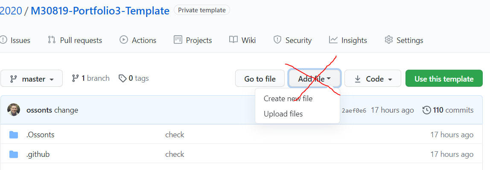
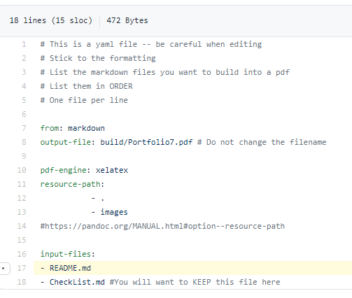
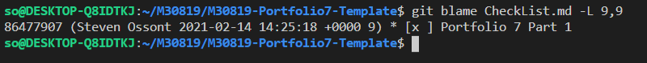
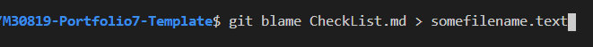
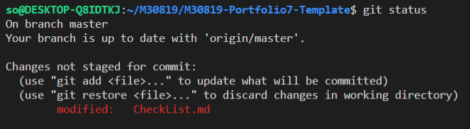
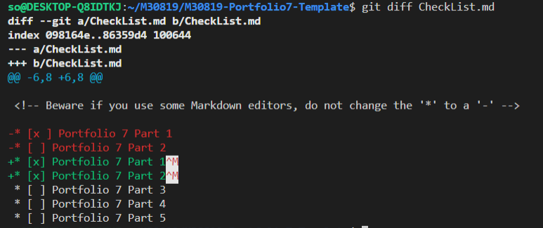
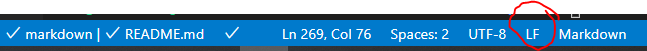
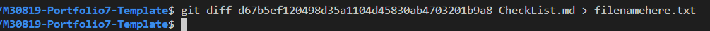
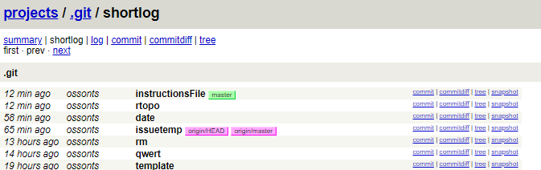
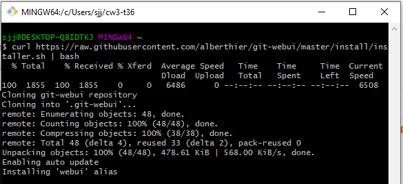

# **Software Engineering Theory and Practice**

|  School of Computing |  |
| --------------- | --------------- |
| Title | Software Engineering Theory and Practice |
| Module Coordinator| Steven Ossont|
| Email | steven.ossont@port.ac.uk|
| Code | M30819|
| Moodle | [https://moodle.port.ac.uk/course/view.php?id=11429](https://moodle.port.ac.uk/course/view.php?id=11429) |

## Schedule and Deliverables

| Item | Value | Format | Outcomes | Deadline |
| --- | --- | --- | --- | --- |
| Portfolio7 | 1% | GitHub Repo | Pass/Fail |  05 March 2021, 23:00 |

## Notes and Advice

<!-- markdown-link-check-disable -->
* The [Extenuating Circumstances procedure](https://myport.port.ac.uk/my-course/extenuating-circumstances ) is
  there to support you if you have had any circumstances (problems) that have
  been serious or significant enough to prevent you from attending, completing
  or submitting an assessment on time.
* The UNION Extenuating Circumstances [Extenuating Circumstances procedure](https://upsu.net/advice/academic-advice/extenuating-circumstances)
* [ASDAC](https://myport.port.ac.uk/guidance-and-support/additional-support-and-disability-advice )
  are available to any students who disclose a disability or require additional
  support for their academic studies with a good set of resources on the [ASDAC
  Moodle site](https://moodle.port.ac.uk/course/view.php?id=3012)
* The University takes plagiarism seriously. Please ensure you adhere to the
  plagiarism guidelines.
Examination Regulations ([http://regulations.docstore.port.ac.uk/ExamRegs12AssessmentOffences.pdf](http://regulations.docstore.port.ac.uk/ExamRegs12AssessmentOffences.pdf)).
* Any material included in your coursework should be
  fully cited and referenced in APA format (seventh edition). Detailed advice on
  referencing is available from [http://referencing.port.ac.uk/](http://referencing.port.ac.uk/)
* Any material submitted that does not meet format or submission guidelines, or
  falls outside of the submission deadline could be subject to a cap on your
  overall result or disqualification entirely.
* If you need additional assistance, you can ask your personal tutor, learning
  support ana.baker@port.ac.uk and xia.han@port.ac.uk or your lecturers.
<!-- markdown-link-check-enable-->

## Git commands

So far you have learnt the following git commands, if you are unclear what these are you MUST practice. You are expected to know them and how to use them without explanation.

```shell
git clone
git add
git pull
git commit
git push
git branch
git merge
git checkout
```

And your trusted command, to help figure what is going on....

```shell
git status
```

> Your repository will be copied for marking automatically at the deadline.
> EDITS after the deadline are automatically ignored.

When you update the `CheckList.md` file. This will trigger an action to inspect the work for this part of the Portfolio.(You can also manually run the `PortfolioChecker` if you need to see if changes solve any errors)

Files, external to this repo and any images imported via URL will be ignored (Even if they are stored in GitHub).

Large blocks of text that use the 'CODE' formatting will be ignored. This includes using triple \`\`\` (Unless it is code or something sensible).
If it looks like you are using \`\`\` to contain Markdown to avoid the lint checker, it will be ignored.
Code blocks should be labeled with the code language so that the syntax highlighter is enabled.

Here is a helpful Markdown link: [https://github.com/adam-p/markdown-here/wiki/Markdown-Cheatsheet#code](https://github.com/adam-p/markdown-here/wiki/Markdown-Cheatsheet#code)

At no point in this Assessment should you use the `Add file` button on the GitHub webpage -- Pretend it does not exist

Marking is performed on a Ubuntu machine. This means that everything is case sensitive, where it may not be on Windows.

> Clone, Edit, Commit, Push  (Preferably on the command line)



## Objectives

* 100% valid Student ID success rate for the whole class. (Incorrect or absent Student ID = 0% no exceptions)
* Explore GitHub functionality
* Prepare for CW4 & CW5

> The process is **different** this time, there is more error checking in the GitHub Actions, You must watch the output for errors/warning. If you have problems or suspect an error, please screenshot and open an issue.

## Portfolio 7 Part 1

Create a file with the filename `Student.id`, add your Student ID to the content of this file. Note:

* Invalid ID = No marks
* The file extension is `.id` other file extensions e.g. `.txt` are not permitted
* The content of the file should be your ID ONLY, e.g. `UP1234567`
* You may have a return character at the end of the line `\n` (Note this is not two ASCII text characters)
* You need the `UP`
* Filename is case sensitive
* File contents are case sensitive
* File should contain one line of text only
* Markdown formatting is NOT permitted e.g. `*` or `-`

> Instructions are slightly different this time, please follow the instructions.

<!-- Save, Commit -->

When you have completed this part of the portfolio :

* Manually run the `PortfolioChecker` action, and ensure it passes. (Must PASS)
* Navigate to the `PortfolioChecker` action on GitHub.com and read the feedback / errors / comments
* Manually run the `Pandoc` action, and check the resulting PDF is as expected. (Must PASS)
* Manually run the `MarkdownChecker` action, this will be superseded by the super-linter. (Must PASS)
* Manually run the `SuperLinter` action, please do your best to ensure there are no errors on *your* files. (Feedback on this action is appreciated)
* Add any files that are needed for this part (if any), to your GitHub repo E.g. new files that you created
* Put an `X` in the `CheckList.md` to indicate this part of the Portfolio is complete
* Commit and **push** your changes to GitHub
* Be sure to address any errors from the GitHub actions
* You do not need to wait for the `PortfolioChecker` to complete, if it is running slow. Proceed and come back and look at the checker errors/warnings when it completes.

<!-- Save, Commit -->

## Portfolio 7 Part 2

Git hub has a URL shortener. The same as `Bit.ly` and `Goo.gl`

1. Go to `https://git.io/`
2. Create a shortened link to this repo
3. Create a file called `short.url`
4. Put the short URL in the `short.url` file
   * ASCII text only
   * One line only

<!-- Save, Commit -->

When you have completed this part of the portfolio :

* Manually run the `PortfolioChecker` action, and ensure it passes. (Must PASS)
* Navigate to the `PortfolioChecker` action on GitHub.com and read the feedback / errors / comments
* Manually run the `Pandoc` action, and check the resulting PDF is as expected. (Must PASS)
* Manually run the `MarkdownChecker` action, this will be superseded by the super-linter. (Must PASS)
* Manually run the `SuperLinter` action, please do your best to ensure there are no errors on *your* files. (Feedback on this action is appreciated)
* Add any files that are needed for this part (if any), to your GitHub repo E.g. new files that you created
* Put an `X` in the `CheckList.md` to indicate this part of the Portfolio is complete
* Commit and **push** your changes to GitHub
* Be sure to address any errors from the GitHub actions
* You do not need to wait for the `PortfolioChecker` to complete, if it is running slow. Proceed and come back and look at the checker errors/warnings when it completes.

<!-- Save, Commit -->

## Portfolio 7 Part 3

You can deep link and highlight **part** of a file in GitHub.
For example: Remember to remove the `README.md` on line 17 of your `.pandoc.yml` file.

Click here to see the line: [.pandoc.yml#L17](.pandoc.yml#L17)

> Adding `#L17` to the end of a GitHub URL will highlight that line in the file.



> You can also highlight a range of lines using `#L10-#L15` ; Highlight all lines 10 to 15.

For example: [.pandoc.yml#L10-#L15](./.pandoc.yml#L10:L15)

> Hover over the link above to view the full URL

This is very handy if you want to send a link to a team member, highlighting a specific issue/line(s).

1. Create a file called `highlight.url`
2. Add a URL to the `highlight.url` file. The URL should highlight the one line in the `.pandoc.yml` file that sets the PDF output filename name; used by the pandoc generator.
3. Check that the `highlight.url` file contents are
   * only one URL
   * One line only
   * URL must include `http`
   * URL will be validated using `curl`

<!-- Save, Commit -->

When you have completed this part of the portfolio :

* Manually run the `PortfolioChecker` action, and ensure it passes. (Must PASS)
* Navigate to the `PortfolioChecker` action on GitHub.com and read the feedback / errors / comments
* Manually run the `Pandoc` action, and check the resulting PDF is as expected. (Must PASS)
* Manually run the `MarkdownChecker` action, this will be superseded by the super-linter. (Must PASS)
* Manually run the `SuperLinter` action, please do your best to ensure there are no errors on *your* files. (Feedback on this action is appreciated)
* Add any files that are needed for this part (if any), to your GitHub repo E.g. new files that you created
* Put an `X` in the `CheckList.md` to indicate this part of the Portfolio is complete
* Commit and **push** your changes to GitHub
* Be sure to address any errors from the GitHub actions
* You do not need to wait for the `PortfolioChecker` to complete, if it is running slow. Proceed and come back and look at the checker errors/warnings when it completes.

<!-- Save, Commit -->

## Portfolio 7 Part 4

GitHub has a `blame` function. One day they will rename this so it is less negative, but we will live with this for now. It is not personal.

Read this:

* [https://git-scm.com/docs/git-blame](https://git-scm.com/docs/git-blame)

Perhaps they should call it: `Show_Me_Who_Last_Edited_A_line_And_On_Which_Commit`

Imagine there is a file in your repo that changes, or that introduces a bug. You probably want to know how it got there, and what was the motivation that introduced it.

> Always start at the command line

To see who edited your `CheckList.md` file and ticked Part1 as completed you can try this, replacing the `START_LINE` and `END_LINE` with line numbers.

`git blame CheckList.md -L START_LINE,END_LINE`

For example 

As you can see, `Ossonts` last edited line `9` and put the incorrect `x` (It should be uppercase; and there should not be a space between the brackets)

This current portfolio repo is not very exciting as there are not many commits.

Please go to your `cw3` repo and run the git blame command on the `CheckList.md` file to see who edited it last. Capture this output into a file called `blame.txt` and commit the file to **this** repo.

* Do not restrict to line numbers.
* Do not use an image.

For example:



<!-- Save, Commit -->

When you have completed this part of the portfolio :

* Manually run the `PortfolioChecker` action, and ensure it passes. (Must PASS)
* Navigate to the `PortfolioChecker` action on GitHub.com and read the feedback / errors / comments
* Manually run the `Pandoc` action, and check the resulting PDF is as expected. (Must PASS)
* Manually run the `MarkdownChecker` action, this will be superseded by the super-linter. (Must PASS)
* Manually run the `SuperLinter` action, please do your best to ensure there are no errors on *your* files. (Feedback on this action is appreciated)
* Add any files that are needed for this part (if any), to your GitHub repo E.g. new files that you created
* Put an `X` in the `CheckList.md` to indicate this part of the Portfolio is complete
* Commit and **push** your changes to GitHub
* Be sure to address any errors from the GitHub actions
* You do not need to wait for the `PortfolioChecker` to complete, if it is running slow. Proceed and come back and look at the checker errors/warnings when it completes.

<!-- Save, Commit -->

## Portfolio 7 Part 5

At this stage, you should be typing `git status` if you are unsure about something; left the repo for a while and came back; can't remember what was going on; or suspect some sort of error/conflict.

`git status` should be the command you type while you think what to do next; probably the most frequently used command. It can save you from accidentally committing incorrect files/changes. Especially for those of you who use the `commit -a` parameter (for all changes)

`git status` will tell you what changes are not committed. For example, you can see there are changes to the `CheckList.md`:



Now it is time to see what these changes are and decide if they should be committed.

Running `git diff` on a file will show the changes not yet committed. There are two deleted lines (red) and two added lines (green).



There is also a line ending issue.`^M`

You can see that the change not only includes an update to the CheckList parts 1 & 2, but also the line ending character (there is a new `^M`).

This is a Windows/Mac/Unix problem. Please read:

* [https://peterbenjamin.com/seminars/crossplatform/texteol.html](https://peterbenjamin.com/seminars/crossplatform/texteol.html)

Further reading if required :

* [https://en.wikipedia.org/wiki/Newline](https://en.wikipedia.org/wiki/Newline)

In VS-Code (and almost all other good editors) you can set the line ending.

For example click here:



> For those that open and edit the files in the `.Ossonts` folder, they all use `LF` endings and if you default to something else, and then commit the files, there is a chance the scripts will not run.
> Then, there is a chance that the SHA wont get logged and this results in the incorrect version of your submitted code bing marked. There is now a watcher on these files and if you get a message about committing changes to these files, do check the line endings. Please don't commit changes in the `.Ossonts` folder.

Please read:

* Some examples of git diff [https://www.toolsqa.com/git/git-diff/](https://www.toolsqa.com/git/git-diff/)

* Comparing using GitHub  [https://docs.github.com/en/github/committing-changes-to-your-project/comparing-commits](https://docs.github.com/en/github/committing-changes-to-your-project/comparing-commits)

1. Use git diff to compare the current commit of the `CheckList.md` file in this repo, with the **first** commit in the repo.

   * `git log Checklist.md` will show a list of all the commits that update the `CheckList.md`
   * The command above will show the hash of the first commit (You will need this)
   * Execute `git diff COMMIT_HASH_HERE CheckList.md` to see the difference. You will see the lines you have updated.
   * Redirect the output into a file called `diff.txt`. Add; commit and push this file.

  The example below, will write the diff file:



Git diff is very powerful. You can use the `HEAD@{1}` syntax to compare the commit at the HEAD with the previous commit.

Experiment with these commands:

1. `git diff HEAD@{0} CheckList.md`
2. `git diff HEAD@{1} CheckList.md`
2. `git diff HEAD@{2} CheckList.md`

<!-- Save, Commit -->

When you have completed this part of the portfolio :

* Manually run the `PortfolioChecker` action, and ensure it passes. (Must PASS)
* Navigate to the `PortfolioChecker` action on GitHub.com and read the feedback / errors / comments
* Manually run the `Pandoc` action, and check the resulting PDF is as expected. (Must PASS)
* Manually run the `MarkdownChecker` action, this will be superseded by the super-linter. (Must PASS)
* Manually run the `SuperLinter` action, please do your best to ensure there are no errors on *your* files. (Feedback on this action is appreciated)
* Add any files that are needed for this part (if any), to your GitHub repo E.g. new files that you created
* Put an `X` in the `CheckList.md` to indicate this part of the Portfolio is complete
* Commit and **push** your changes to GitHub
* Be sure to address any errors from the GitHub actions
* You do not need to wait for the `PortfolioChecker` to complete, if it is running slow. Proceed and come back and look at the checker errors/warnings when it completes.

<!-- Save, Commit -->

## Portfolio 7 Part 6

For group projects or large projects where the number of issues gets large, you may want to encourage particular content in the issue as a bare minimum. For example, you may want to template a series of questions that must be answered in every new issue to help process the issues.

> For those that often forget to mention team members or a staff member when opening an issue. You could template an issue so that it contains a pre defined mention.

GitHub issues can be templated using a file called `ISSUE_TEMPLATE.md` -- this is a markdown file and so can contain markdown syntax to help with formatting.

> `ISSUE_TEMPLATE.md` can be on the root of the repo. This looks untidy, normally it is best to store it in the `.github` folder of your repo.

1. Create a markdown github issue template in the **root** of this repo. Altering files in the `.github` folder will automatically raise an issue on Portfolios as the files in the `.github` folder are not for editing. This template should contain:

   * Level one heading (e.g. Please complete each section below)
   * Checklist (e.g Is repeatable; Build error; Syntax error)
   * Mention `@ossonts` (e.g. This should add a mention to @ossonts to your issue automatically)

2. Open a new issue. (It must automatically use your template -- if not the template file is not found)

   * Fill in the sections of your issue template (e.g. mention this is a test of an issue template)
   * Do not close this issue

<!-- Save, Commit -->

When you have completed this part of the portfolio :

* Manually run the `PortfolioChecker` action, and ensure it passes. (Must PASS)
* Navigate to the `PortfolioChecker` action on GitHub.com and read the feedback / errors / comments
* Manually run the `Pandoc` action, and check the resulting PDF is as expected. (Must PASS)
* Manually run the `MarkdownChecker` action, this will be superseded by the super-linter. (Must PASS)
* Manually run the `SuperLinter` action, please do your best to ensure there are no errors on *your* files. (Feedback on this action is appreciated)
* Add any files that are needed for this part (if any), to your GitHub repo E.g. new files that you created
* Put an `X` in the `CheckList.md` to indicate this part of the Portfolio is complete
* Commit and **push** your changes to GitHub
* Be sure to address any errors from the GitHub actions
* You do not need to wait for the `PortfolioChecker` to complete, if it is running slow. Proceed and come back and look at the checker errors/warnings when it completes.

<!-- Save, Commit -->

## Portfolio 7 Part 7

The `grep` command is extremely powerful for searching text files; it is a standalone command in linux:

[https://linux.die.net/man/1/grep](https://linux.die.net/man/1/grep)

Here are some examples of it being used:

[https://www.thegeekstuff.com/2009/03/15-practical-unix-grep-command-examples/](https://www.thegeekstuff.com/2009/03/15-practical-unix-grep-command-examples/)

Grep lets you search for words in files. It can be used with the `git` command.

[https://git-scm.com/docs/git-grep](https://git-scm.com/docs/git-grep)

1. Use the `git grep` command to search for your Student ID in this repo.
2. Take an image of the results. It must show:

* the command
* your Student ID

Save the image as `grep.png`. File name is case sensitive.

<!-- Save, Commit -->

When you have completed this part of the portfolio :

* Manually run the `PortfolioChecker` action, and ensure it passes. (Must PASS)
* Navigate to the `PortfolioChecker` action on GitHub.com and read the feedback / errors / comments
* Manually run the `Pandoc` action, and check the resulting PDF is as expected. (Must PASS)
* Manually run the `MarkdownChecker` action, this will be superseded by the super-linter. (Must PASS)
* Manually run the `SuperLinter` action, please do your best to ensure there are no errors on *your* files. (Feedback on this action is appreciated)
* Add any files that are needed for this part (if any), to your GitHub repo E.g. new files that you created
* Put an `X` in the `CheckList.md` to indicate this part of the Portfolio is complete
* Commit and **push** your changes to GitHub
* Be sure to address any errors from the GitHub actions
* You do not need to wait for the `PortfolioChecker` to complete, if it is running slow. Proceed and come back and look at the checker errors/warnings when it completes.

<!-- Save, Commit -->

## Portfolio 7 Part 8

Imagine the situation where you have a GitHub (or just a git) repo on your local machine. You do not have internet connectivity and you need browse the commits of the repo.

`git instaweb` will setup a webserver (local) for the repo that you are currently viewing

Read: [https://git-scm.com/docs/git-instaweb](https://git-scm.com/docs/git-instaweb)

1. Run instaweb on this repo
2. Save an image called `localUI.png` of the instaweb shortlog for your repo. It should show:

   * the URL
   * the commit log (see below)

 

For those using WSL there is a known issue that results in a server 500 error. The problem is a missing library.

* Run `sudo apt install  lighttpd` to install a webserver
* Run `sudo apt install libcgi-pm-perl gamin` to install the missing dependencies.

More information here: [https://github.com/microsoft/WSL/issues/4871](https://github.com/microsoft/WSL/issues/4871)

For those that are not Mac; Linux or WSL users you can use this alternative:

[https://github.com/alberthier/git-webui](https://github.com/alberthier/git-webui)



> Be sure to save an image called `localUI.png`

<!-- Save, Commit -->

When you have completed this part of the portfolio :

* Manually run the `PortfolioChecker` action, and ensure it passes. (Must PASS)
* Navigate to the `PortfolioChecker` action on GitHub.com and read the feedback / errors / comments
* Manually run the `Pandoc` action, and check the resulting PDF is as expected. (Must PASS)
* Manually run the `MarkdownChecker` action, this will be superseded by the super-linter. (Must PASS)
* Manually run the `SuperLinter` action, please do your best to ensure there are no errors on *your* files. (Feedback on this action is appreciated)
* Add any files that are needed for this part (if any), to your GitHub repo E.g. new files that you created
* Put an `X` in the `CheckList.md` to indicate this part of the Portfolio is complete
* Commit and **push** your changes to GitHub
* Be sure to address any errors from the GitHub actions
* You do not need to wait for the `PortfolioChecker` to complete, if it is running slow. Proceed and come back and look at the checker errors/warnings when it completes.

<!-- Save, Commit -->

## Portfolio 7 Part 9

1. Remove the `README.md` file from the PDF (see `.pandoc.yml`)
2. Using one or more markdown files and by altering the `.pandoc.yml` please include the following content into your PDF. In this order:

* a Markdown level one heading `Portfolio 7`
* a Markdown level two heading for `Portfolio 7 Part 2`
* add the `short.url` file to `.pandoc.yml`
* a Markdown level two heading for `Portfolio 7 Part 3`
* add the `highlight.url` file to `.pandoc.yml`
* a Markdown level two heading for `Portfolio 7 Part 4`
* add the `blame.txt` file to `.pandoc.yml`
* a Markdown level two heading for `Portfolio 7 Part 5`
* add the `diff.txt` file to `.pandoc.yml`
* a Markdown level two heading for `Portfolio 7 Part 6`
* add the `ISSUE_TEMPLATE.md` file to  `.pandoc.yml`
* a Markdown level two heading for `Portfolio 7 Part 7`
* add the `grep.png` file to the PDF
* a Markdown level two heading for `Portfolio 7 Part 8`
* add the `localUI.png` file to the PDF
* a Markdown level two heading for `Student ID`
* add the `Student.id` file to  `.pandoc.yml`

7. Check the PDF is built correctly. (PDF is marked)

<!-- Save, Commit -->

When you have completed this part of the portfolio :

* Manually run the `PortfolioChecker` action, and ensure it passes. (Must PASS)
* Navigate to the `PortfolioChecker` action on GitHub.com and read the feedback / errors / comments
* Manually run the `Pandoc` action, and check the resulting PDF is as expected. (Must PASS)
* Manually run the `MarkdownChecker` action, this will be superseded by the super-linter. (Must PASS)
* Manually run the `SuperLinter` action, please do your best to ensure there are no errors on *your* files. (Feedback on this action is appreciated)
* Add any files that are needed for this part (if any), to your GitHub repo E.g. new files that you created
* Put an `X` in the `CheckList.md` to indicate this part of the Portfolio is complete
* Commit and **push** your changes to GitHub
* Be sure to address any errors from the GitHub actions
* You do not need to wait for the `PortfolioChecker` to complete, if it is running slow. Proceed and come back and look at the checker errors/warnings when it completes.

<!-- Save, Commit -->

## Portfolio 7 Completed

> Tip GitHub now has a night/dark mode [https://github.com/settings/appearance](https://github.com/settings/appearance) why not give it a go if you are working at night?

You must run these actions [**Run these actions manually now**]:

*  [Must pass]
*  [Must pass]
*  [Must pass]
*  [EXPERIMENTAL action; please attempt to resolve your errors]

[Banners above are **EXPERIMENTAL**; do not rely on them]

* Commit and push your changes to GitHub

Complete the checklist and submit by putting an `X` in the portfolio checklist to indicate the Portfolio is complete and ready to mark.

> If you want to re-submit your work, any time before the deadline. You can un-tick the Portfolio Completed checkbox; **commit & push;** then re-tick Portfolio Completed checkbox; **commit & push.**

Once you have done this step, the commit hash of your latest commit should be in `.Ossonts/latestSHA.log`

* Double check that this commit hash (URL is included in `.Ossonts/latestSHA.log`) is the version you want to submit.
* If this commit hash is **incorrect**; Re-submit your portfolio. (See above).
* If you commit hash was **NOT** correct please raise an issue as well as resubmitting to correct the SHA.

<!-- Save, Commit -->

When you have completed this part of the portfolio :

* Manually run the `PortfolioChecker` action, and ensure it passes. (Must PASS)
* Navigate to the `PortfolioChecker` action on GitHub.com and read the feedback / errors / comments
* Manually run the `Pandoc` action, and check the resulting PDF is as expected. (Must PASS)
* Manually run the `MarkdownChecker` action, this will be superseded by the super-linter. (Must PASS)
* Manually run the `SuperLinter` action, please do your best to ensure there are no errors on *your* files. (Feedback on this action is appreciated)
* Add any files that are needed for this part (if any), to your GitHub repo E.g. new files that you created
* Put an `X` in the `CheckList.md` to indicate this part of the Portfolio is complete
* Commit and **push** your changes to GitHub
* Be sure to address any errors from the GitHub actions
* You do not need to wait for the `PortfolioChecker` to complete, if it is running slow. Proceed and come back and look at the checker errors/warnings when it completes.

<!-- Save, Commit -->

## **Your repository will be copied for marking automatically at the coursework deadline OR when the Completed checklist item is ticked; whichever is earliest**
